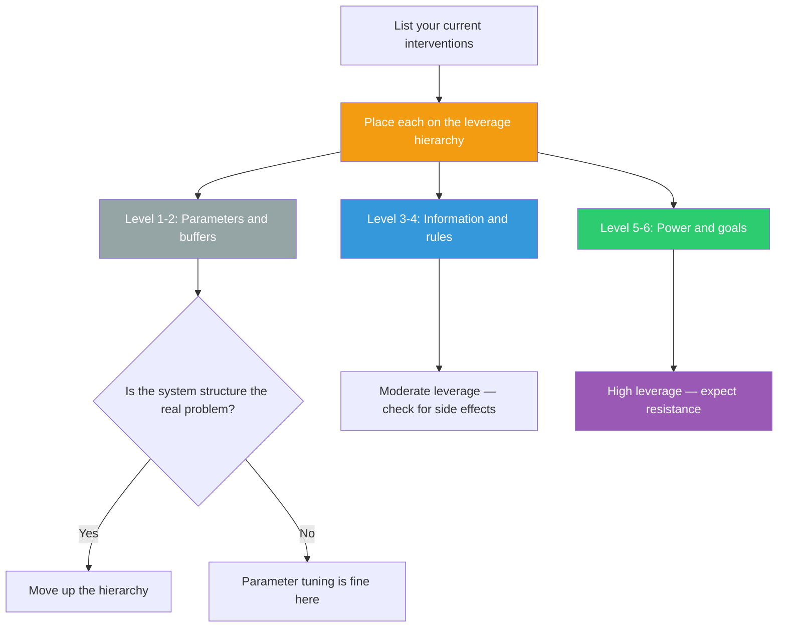

## The Move

List the interventions you're considering (or already executing). For each one, place it on this hierarchy from weakest to strongest leverage: (1) adjusting numbers/parameters, (2) adjusting buffer sizes, (3) improving information flows, (4) changing the rules, (5) changing who makes the rules, (6) changing the goal of the system. If most of your effort is at levels 1-2, you're tweaking parameters in a system whose structure is the problem. Move up the hierarchy. Identify the highest-leverage intervention you could make and write down what it would take to execute it.

## When to Use

- Repeated interventions keep producing temporary results that fade
- You sense the problem is structural but you're treating symptoms
- The team is busy and productive but the needle isn't moving
- You're about to invest significant effort and want to make sure it's aimed at the right level
- Multiple possible interventions are on the table and you need to choose

## Diagram

## Example

**Problem:** "Page load time is too slow. We've been optimizing queries and adding caching for months."

**Placing interventions on the hierarchy:**

- **Level 1 (parameters):** Tuning cache TTLs, adjusting query timeouts, increasing server count. You've been here for months.
- **Level 3 (information flows):** Adding performance monitoring so every team sees how their code affects load time. Nobody currently knows which service is the bottleneck.
- **Level 4 (rules):** Establishing a performance budget — no PR merges if it regresses the p95 by more than 50ms. Changes the game from "optimize after the fact" to "don't regress in the first place."
- **Level 6 (goals):** Redefining the product around speed as a feature — like how Google made "fast" the core identity of Search, not an afterthought.

**The insight:** The team has been at Level 1 for months. The highest-leverage realistic move is Level 4 — a performance budget baked into CI. One rule change does more than a hundred cache optimizations because it changes the structure that produces the problem.

## Watch Out For

- Higher leverage doesn't mean easier. Changing rules or goals faces political resistance. You need both the insight and the authority (or persuasion) to act on it
- Meadows herself warned that people often push leverage points in the wrong direction. Finding the point is half the work — the other half is knowing which way to push
- Don't dismiss low-leverage interventions entirely. Sometimes you need a quick parameter fix now while you work toward a structural change later
- This move pairs well with Feedback Loop Audit (TF-030). The leverage point is often a place in a feedback loop where a small change alters the loop's behavior
