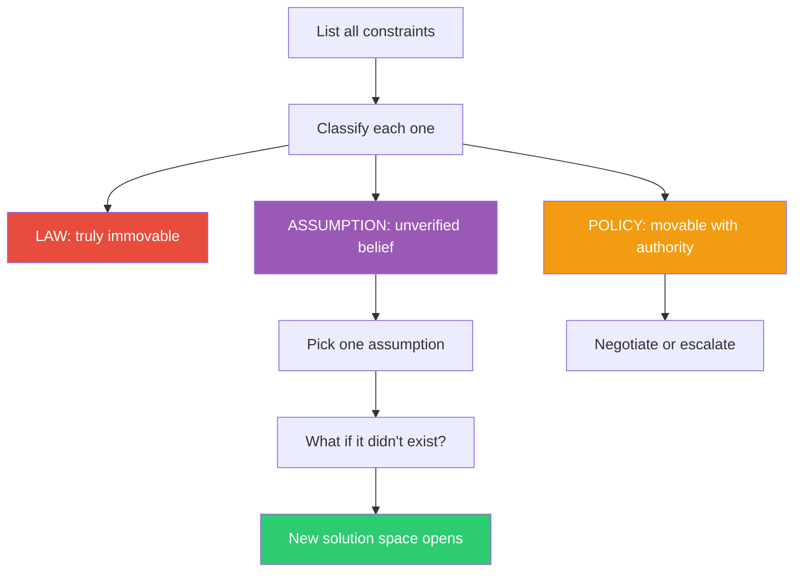

## The Move

List every constraint on your problem — technical, organizational, temporal, budgetary, all of them. Now classify each one into exactly one of three categories: **LAW** (physics, mathematics, regulation — truly immovable), **POLICY** (an organizational or team decision — movable with authority or persuasion), or **ASSUMPTION** (something you believe is fixed but haven't actually verified). Be ruthless: most things that feel like laws are policies, and most things that feel like policies are assumptions. How would {{thinker.1}} classify these constraints? Pick one assumption and ask: "What would the solution look like if this constraint didn't exist?" Relaxing even one false constraint can unlock the entire problem.

## When to Use

- You feel boxed in with no viable options
- Someone says "we can't do that" and you want to check whether that's actually true
- The problem has been framed the same way for so long that nobody questions the boundaries
- You're planning and want to maximize your degrees of freedom before committing

## Diagram

## Example

**Problem:** "We need to migrate our monolith to microservices, but we can't take any downtime and we only have two engineers."

**Constraint list:**
1. Must migrate to microservices — **ASSUMPTION.** Who said microservices? The actual need is "the monolith is too slow to deploy." Microservices are one solution, not a constraint.
2. Zero downtime — **POLICY.** The SLA says 99.9%, which allows ~8 hours of downtime per year. A 2-hour maintenance window at 3 AM on a Saturday is within SLA.
3. Two engineers available — **LAW** (for now). Headcount is fixed this quarter.
4. Must use Kubernetes — **ASSUMPTION.** The CTO mentioned it once. Nobody confirmed this is a requirement.
5. Can't change the database schema — **ASSUMPTION.** The fear is breaking other systems, but nobody has mapped which systems actually read from these tables.

**Result:** Three of five "constraints" are assumptions. Relaxing #1 alone (do you actually need microservices, or do you need faster deploys?) reframes the entire project. Maybe a modular monolith with parallel CI pipelines solves the real problem in a quarter of the time.

## Watch Out For

- Don't reclassify actual laws as assumptions to make yourself feel better. Gravity is a law. Regulatory compliance is usually a law. Be honest
- Policies aren't bad — they exist for reasons. But they should be *chosen*, not mistaken for physics. If you want to relax a policy, talk to the person who set it
- The scariest move is checking whether an assumption is real. You might discover the constraint never existed, or you might confirm it's hard. Either way, you've upgraded from guessing to knowing
- This pairs well with TF-019 (Map the Assumptions) for a deeper dive into assumption-heavy problems
