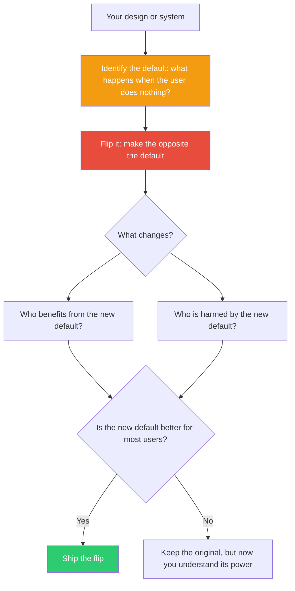

## The Move

Identify the **default** in your design — the thing that happens if the user, system, or process does nothing. The path of least resistance. The pre-selected option. The behavior when no one intervenes.

What default would {{persona.1}} expect — and is it the one you built? Now flip it. Make the opposite the default.

If notifications are off by default, make them on. If the data is public by default, make it private. If the advanced settings are hidden by default, make them visible. If deploys require manual approval, make them auto-deploy. (Or vice versa for any of these.)

You don't have to ship the flip. The point is to see what the current default is *actually choosing for people* — because most people never change the default, and that makes the default the real design decision.

## When to Use

- Users aren't doing the thing you want them to do — maybe you made the wrong thing the default
- You're designing any system with settings, preferences, or options
- You inherited a system and never questioned its default state
- Adoption is low for a feature that's good but opt-in

## Diagram

## Example

**Design:** A project management tool where task due-date reminders are off by default. Users can turn them on in settings.

**Current default:** No reminders. The user must discover the setting, navigate to it, and enable it. Most users never do.

**Flipped default:** Reminders are on. A gentle nudge arrives 24 hours before each due date. Users who don't want them can turn them off.

**What changes:** Suddenly most users get reminders, because most users never touch settings. Overdue tasks drop. The feature that "nobody used" turns out to be the feature nobody *found*. The problem was never the feature — it was the default.

**A harder flip:** What if the default for new tasks was *no due date at all* instead of requiring one? That might reveal that mandatory due dates create fake deadlines that erode trust in the system. The default was forcing a behavior that degraded data quality.

## Watch Out For

- Flipping defaults in production has real consequences. This move is a *thought experiment first*, a design change second. Think before you ship.
- Some defaults exist for safety or legal reasons (data sharing off by default, destructive actions require confirmation). Don't flip those carelessly.
- The most dangerous defaults are the ones you never noticed. Look for them in: permissions, visibility, communication frequency, data retention, and feature enrollment.
- "Nobody uses this feature" and "this feature is off by default" are frequently the same statement wearing different clothes.
