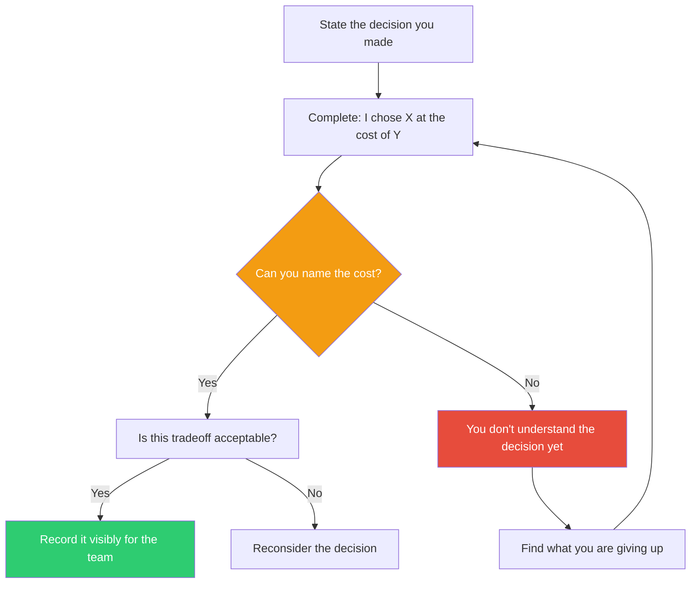

## The Move

For the decision you just made (or are about to make), complete this sentence: "I'm choosing ___ at the cost of ___." Both blanks must be concrete. If you can't fill in the second blank, you haven't understood the decision yet — go find what you're trading away. Then ask: is this tradeoff one I'd make again if someone presented it to me fresh? Now restate the tradeoff in {{language.1}} — what nuance shifts? Write the tradeoff statement somewhere the team can see it. When the cost shows up later (and it will), you'll know it was a conscious choice, not an accident.

## When to Use

- Before finalizing any design or architecture decision
- When a decision "feels obvious" — obvious decisions often have hidden costs
- When the team keeps revisiting a past decision — the tradeoff was probably never made explicit
- When comparing options that seem equivalent on the surface
- During code review or design review, to pressure-test choices

## Diagram

## Example

**Decision:** "We're using a NoSQL database for this new service."

**First attempt:** "I'm choosing NoSQL at the cost of... flexibility?" That's too vague. Try again.

**Better:** "I'm choosing horizontal scalability and schema flexibility at the cost of joins, ACID transactions across documents, and the ability to run ad-hoc analytical queries without a separate system."

**Reality check:** The service is a user activity log. It needs high write throughput, it never needs cross-document transactions, and analytics will be handled by a separate pipeline. The tradeoff is clearly worth it.

**Contrast:** If the service were an order management system with inventory checks and payment processing, that same tradeoff statement — "at the cost of ACID transactions" — would be alarming. Same decision, different context, different answer.

**Record it:** Add to the architecture decision record: "Chose DynamoDB. Tradeoff: no cross-document transactions, no ad-hoc queries. Acceptable because activity logs are append-only and analytics runs in BigQuery."

## Watch Out For

- The tradeoff you can't name is the one that will bite you. If you genuinely can't identify a cost, you're either not looking hard enough or you've found a rare genuine win — and it's almost never the latter
- Naming the tradeoff is not the same as accepting it. Sometimes naming it reveals you've made the wrong choice. That's the point
- Be specific. "Choosing simplicity at the cost of flexibility" is a platitude, not a tradeoff. What *specific* flexibility? What *specific* simplicity? Name the concrete thing you can't do
- Teams that record tradeoffs explicitly revisit decisions less often. When the cost appears months later, they can look back and say "we knew this — it was worth it" instead of "who made this terrible decision?"
- Every "best practice" has a tradeoff too. "Use microservices" trades deployment independence for distributed systems complexity. "Write tests" trades development speed for change confidence. Name those, too
