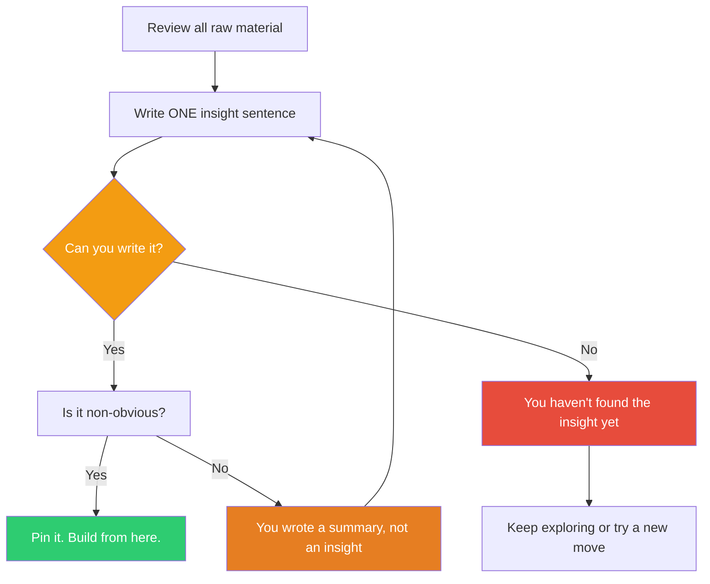

## The Move

Stop generating. Review everything you've produced — ideas, angles, fragments, half-thoughts, seeds. Now write ONE sentence that captures the core insight. Not a summary of what you explored. The single non-obvious thing you now believe that you didn't believe before you started.

If you can't write that sentence, you haven't found the insight yet — keep exploring. If you can, everything else is decoration around it. That sentence is your output. Pin it to the top and let it govern what happens next.

## When to Use

- You've been exploring or brainstorming for multiple rounds and the material is piling up
- You have many promising fragments but no unifying thread
- Someone asks "so what did you conclude?" and you start listing things instead of stating one thing
- You're about to transition from exploration to planning and need a clear anchor
- The session was productive but feels diffuse

## Diagram

## Example

**Situation:** You've spent an hour exploring how to improve onboarding for a developer tool. You've accumulated ideas: interactive tutorials, better docs, sample projects, a CLI wizard, video walkthroughs, a playground environment, Slack community, office hours.

**Attempted summary:** "There are many ways to improve onboarding — tutorials, docs, sample projects, etc." That's a list, not an insight.

**Crystallized insight:** "Developers don't fail at onboarding because they lack instructions — they fail because they can't get to their first real result fast enough. Every minute before their first successful API call is a minute they might quit."

**Why this works:** The sentence isn't a summary of the brainstorm. It's a belief that reorders everything. Now the interactive tutorial matters only if it gets someone to a real API call faster. The video walkthrough is useless if it's "watch first, try later." The CLI wizard wins if it scaffolds a working project in 30 seconds. One sentence turned a scattered list into a prioritization framework.

## Watch Out For

- A summary is not an insight. "There are several promising approaches" is a summary. "The bottleneck isn't where we thought it was" is getting closer. "Users are optimizing for X but we've been designing for Y" is an insight
- If your sentence could have been written before the exploration, it's not a crystallization — it's a pre-existing belief you just confirmed. The insight should surprise you at least a little
- Don't force it. If the sentence isn't coming, that's genuine signal: the exploration hasn't converged yet. Do one more round rather than manufacturing a false insight
- One sentence means one sentence. If you need a paragraph, you haven't compressed enough. The discipline of compression is where the clarity comes from
