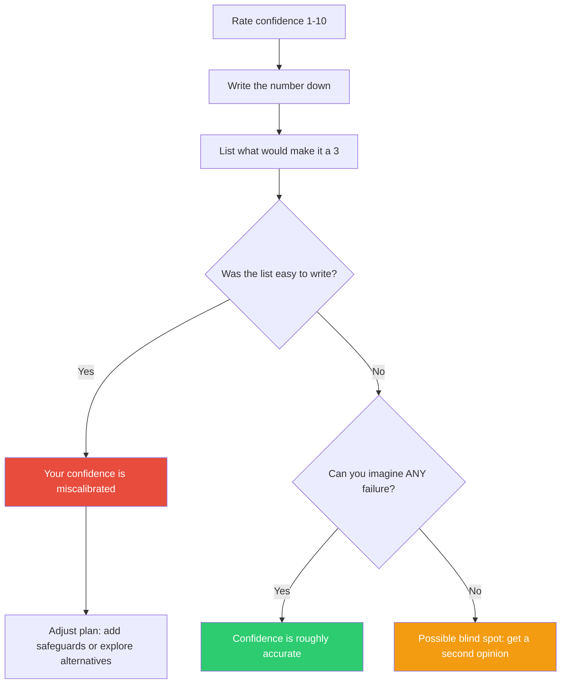

## The Move

Before committing to an approach, rate your confidence on a 1-10 scale that it will work. Write the number down. Now list everything that would have to go wrong for your confidence to drop to a 3. If that list is easy to write — if failure scenarios pour out — your real confidence is lower than you reported. You are experiencing the overconfidence bias: your felt certainty exceeds your evidenced certainty.

If you genuinely cannot imagine realistic failure paths, either you are right or you have a blind spot. Ask someone else to write the failure list.

## When to Use

- Before committing to an architecture, a plan, or a major design decision
- When the team is expressing high confidence without evidence
- When you catch yourself saying "I'm sure this will be fine"
- As a final gate before any decision that is expensive to reverse

## Diagram

## Example

**Situation:** You're about to migrate a monolith's authentication module to a new microservice. You rate your confidence at 8/10 — you've done service extractions before and this one feels clean.

**The calibration:** "What would make this a 3?"
- Session tokens are referenced by 14 other services in ways we haven't fully mapped
- The legacy auth module has undocumented side effects that populate a shared cache
- Our integration tests don't cover the SSO flow that 40% of enterprise customers use
- The database migration could lock the users table for minutes during peak hours

That list took 90 seconds to write. Four concrete, plausible failure paths. Your real confidence is closer to a 5. You haven't done the homework to justify an 8. The right move: investigate the session token dependencies and the shared cache before committing to the migration timeline.

## Watch Out For

- The goal is not to lower your confidence to zero — it's to match your confidence to your evidence. Sometimes an 8 really is an 8
- Don't confuse "I can imagine bad things" with "bad things are likely." The test is whether the failure scenarios are *plausible and specific*, not merely possible
- This move catches overconfidence, not underconfidence. If you chronically rate yourself low, the calibration check won't help — you need a different intervention
- Teams can perform this together: everyone writes a number privately, then reveals. Spread in the numbers is itself a signal
