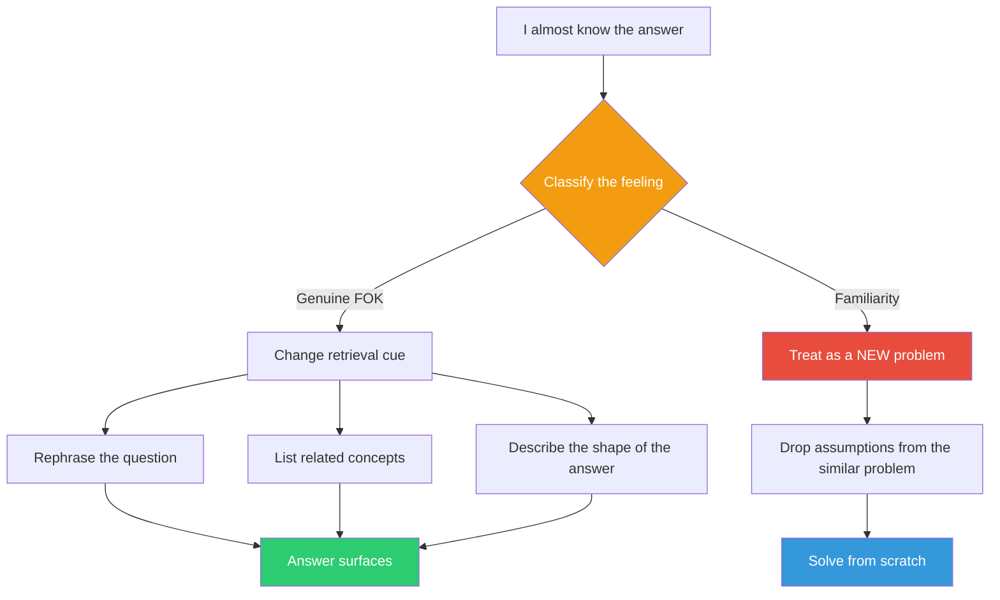

## The Move

You feel like you ALMOST know the answer. Stop and classify that feeling. Is it (A) a genuine feeling of knowing — the answer exists in your experience and you will recognize it when you see it, you just can't retrieve it right now? Or is it (B) a feeling of familiarity — the problem LOOKS like something you have solved before, but this instance is actually different in a way you haven't noticed?

Name which one: "This is FOK" or "This is familiarity." If it is familiarity, treat this as a brand new problem. Drop your assumptions about what the answer should look like. If it is genuine FOK, try a different retrieval cue: rephrase the question, approach from a different angle, list related concepts, or describe the shape of the answer without trying to name it.

## When to Use

- You have been circling the same problem for more than a few minutes with a persistent "almost" feeling
- A problem reminds you strongly of something you have solved before, but the solution is not clicking
- You keep reaching for an approach that "should" work but does not
- You are debugging and the bug "feels" familiar but your usual fixes are not landing

## Diagram

## Example

**Situation:** You are debugging a React component that re-renders excessively. You have a strong feeling you have fixed this before — something about `useMemo` or `useCallback`. You have been trying different memoization strategies for 20 minutes and none of them fix it.

**The check:** Is this FOK or familiarity?

You realize it is familiarity. The previous bug WAS a memoization issue, but this component's re-renders are caused by a context provider high in the tree that changes reference on every render. The problem LOOKS like your old memoization bug but it is structurally different — memoizing the child does nothing because the context value itself is new each time.

**The fix:** Treat it as a new problem. Trace the actual re-render cause with React DevTools profiler instead of pattern-matching against your memory. You find the context provider in under 3 minutes once you stop assuming this is a memoization problem.

## Watch Out For

- Familiarity bias is strongest when you are experienced. Experts pattern-match faster, which is usually an advantage — but it means they also misclassify novel problems as familiar ones more often
- Genuine FOK is a real signal with predictive value. Do not dismiss it — just use a different retrieval strategy instead of grinding on the same mental path
- If you cannot tell which one it is, default to treating it as familiarity. The cost of re-examining a known problem is low; the cost of forcing a wrong pattern onto a new problem is high
- This move takes 30 seconds. The classification itself is the intervention
