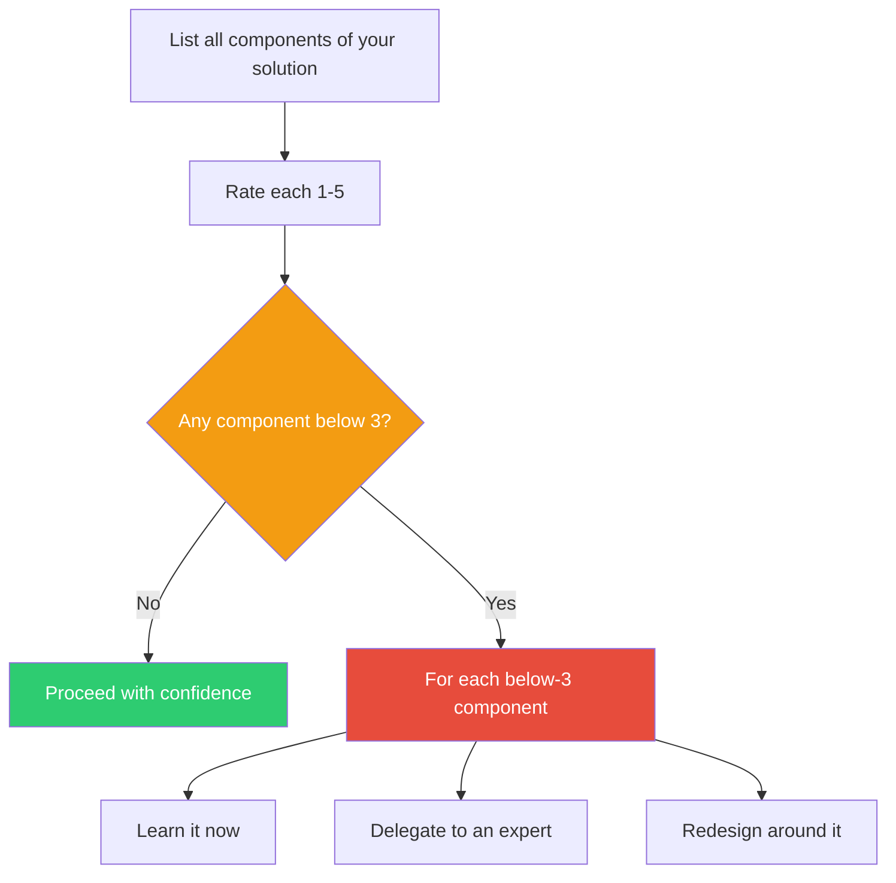

## The Move

List every major component of your solution. For each one, rate your understanding on this scale: (1) I have heard of it. (2) I know roughly what it does. (3) I could explain it to a colleague and answer their follow-up questions. (4) I could implement it from scratch. (5) I could teach someone else to implement it and troubleshoot their mistakes.

Anything below 3 is a risk zone. You are building on ground you do not actually understand. The gap between 2 and 3 is where most illusions of understanding live — you recognize the concept, you can use the right words, but you could not survive a cross-examination.

For each component rated 1 or 2, decide: learn it now, delegate it to someone who is at 4+, or redesign around it.

## When to Use

- Before starting implementation of a plan that involves multiple technologies or domains
- When you suspect you are confusing familiarity with understanding
- During planning, to identify which parts of the solution carry knowledge risk
- When someone says "yeah I know how that works" and you want to pressure-test it (including yourself)

## Diagram

## Example

**Situation:** You are designing a real-time collaborative editing feature. You list the components and rate them:

| Component | Rating | Honest Assessment |
|---|---|---|
| WebSocket server | 4 | Built several, comfortable |
| CRDT algorithm | 2 | Read a blog post, know it handles conflicts "somehow" |
| Operational Transform | 2 | Know it's an alternative to CRDTs, couldn't explain the difference precisely |
| Presence indicators | 4 | Straightforward UI + pub/sub |
| Undo/redo with collaboration | 1 | Never thought about how this works with multiple cursors |

Three components are in the danger zone. The CRDT/OT gap is critical — you are about to make an architectural decision (CRDT vs OT) based on level-2 understanding of both options. The undo/redo problem is a level-1 blind spot that will surface late and painfully.

**Action:** Spend a focused session getting CRDTs to level 3 before choosing. Flag collaborative undo/redo as a research spike. Do not estimate the project timeline until these gaps are closed.

## Watch Out For

- Self-ratings are generous by default. If you are unsure whether you are a 2 or a 3, you are a 2. The test for 3 is: could you survive follow-up questions from a skeptical colleague?
- This is not about being an expert in everything. It is about knowing WHERE your understanding is thin so you can plan around it
- Rating a component 1 or 2 is not shameful — it is useful intelligence. The danger is rating yourself a 3 when you are a 2
- Do this individually before group planning. In groups, social pressure inflates everyone's self-ratings
