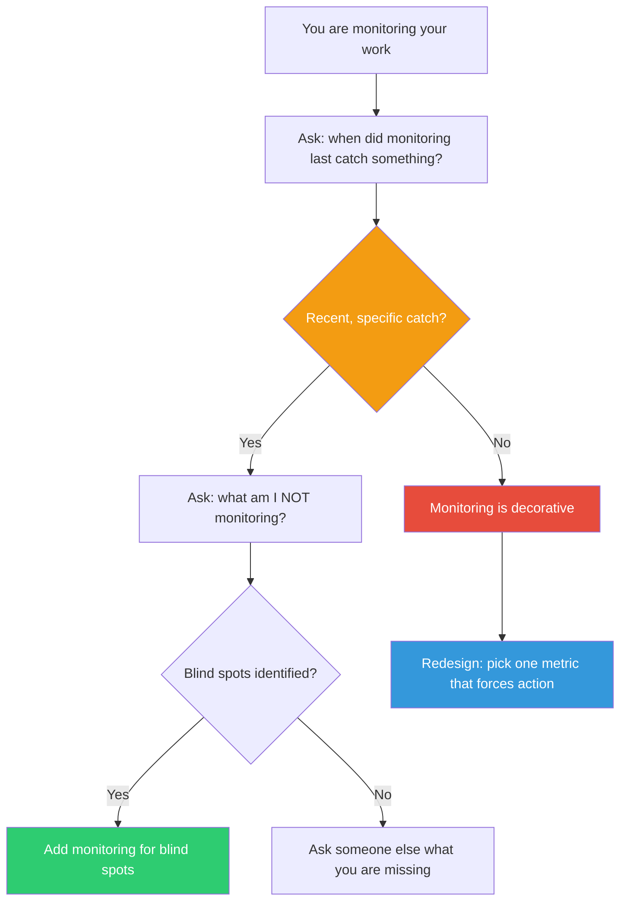

## The Move

Step back one level. You have been monitoring your work — checking progress, reviewing output, noticing problems. But is your monitoring itself working? Answer these {{number}} questions honestly:

1. When was the last time your monitoring caught an error BEFORE it became a problem — not after, not by accident?
2. What are you NOT checking? Name at least two things you have no visibility into.
3. Are you monitoring the right things, or just the things that are easy to measure?
4. Has your monitoring ever caused you to change course? If not, it is decorative.
5. Could someone game your monitoring — produce green dashboards while the actual work degrades?

If you answered "I don't know" or "never" to more than two of these, your monitoring is theater. It creates the feeling of oversight without the function. Redesign it: pick one metric that, if it moved, would FORCE you to act differently. Monitor that. Drop the rest.

## When to Use

- At the end of a sprint or milestone when reviewing how the work went
- When a problem surfaces that "should have been caught" by your existing process
- When your checks and reviews feel ritualistic rather than genuinely protective
- When everything looks fine on paper but outcomes are disappointing

## Diagram

## Example

**Situation:** Your team does code reviews on every PR. You also have CI checks, a test suite, and a weekly architecture review. Despite all this, a significant performance regression shipped to production last week and went unnoticed for three days.

**The meta-monitoring check:**
1. *Last catch?* Code reviews catch style issues and obvious bugs weekly. But they have never caught a performance regression — reviewers do not benchmark.
2. *What are you NOT checking?* Performance under realistic data volumes. Memory usage over time.
3. *Right things?* You are monitoring code correctness (tests) and code quality (reviews) but not runtime behavior. You measure what is easy to automate, not what matters most.
4. *Ever changed course?* The architecture reviews have never resulted in a design change. They are status updates disguised as reviews.

**Action:** Drop the architecture "reviews" (they are not reviews). Add a performance benchmark to CI that fails the build if p95 latency regresses by more than 10%. That single metric would have caught last week's regression before merge.

## Watch Out For

- This move can feel uncomfortably meta — "monitoring the monitoring" sounds like infinite regress. It is not. You go up exactly one level, check that level, and come back down. Do not monitor the monitoring of the monitoring
- The goal is not more monitoring. It is better monitoring. Often the fix is to monitor fewer things more meaningfully
- Decorative monitoring is worse than no monitoring because it creates false confidence. At least with no monitoring you know you are flying blind
- This move applies to personal work habits too, not just team processes. "I re-read my code before committing" — when did that last catch something?
