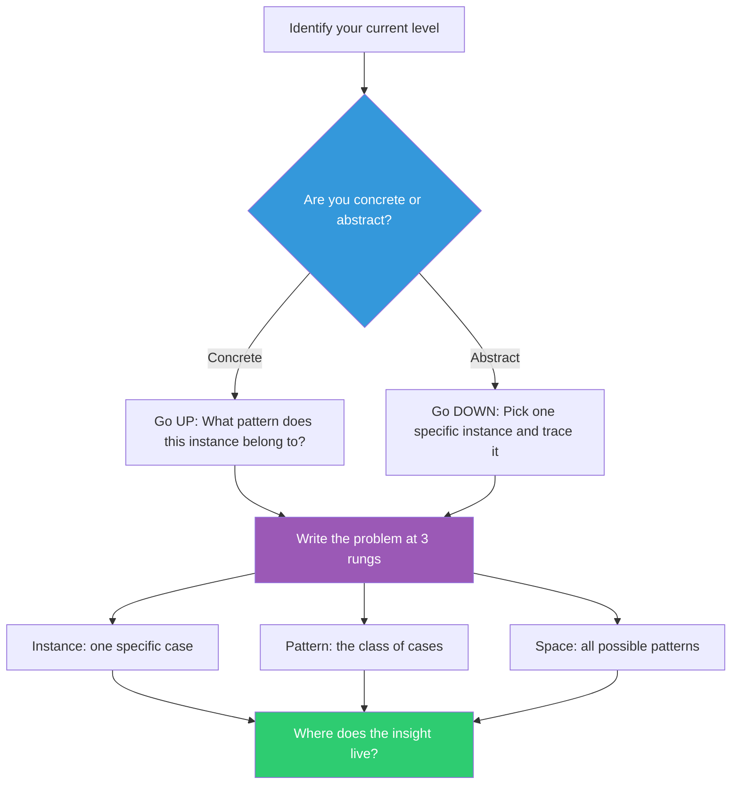

## The Move

Pick the level you're currently thinking at: concrete (one specific input, one user, one bug) or abstract (the general pattern, the architecture, the family of behaviors). Now deliberately move to the OTHER level. If you're debugging one request, ask: what's the general pattern across all failing requests? If you're designing an abstract architecture, ask: what happens when User A sends Payload B at Time C? Write your problem at three rungs: one concrete instance, the pattern it belongs to, and the space of all possible patterns. The insight almost always lives at a different rung than where you're stuck.

## When to Use

- You've been staring at a specific bug for an hour and can't see the pattern
- You have an elegant abstraction that doesn't map to any real scenario
- A debate is stuck because one person is thinking concretely and another abstractly
- You need to move between "this one case" and "the general design" fluidly

## Diagram

## Example

**Situation:** A team is designing a rate-limiting system. The architect keeps proposing token-bucket algorithms and sliding windows. The on-call engineer keeps saying "but what about the bot that hit us last Tuesday?" They've been talking past each other for 30 minutes.

**Climbing the ladder:**

- **Concrete (rung 1):** Last Tuesday, IP 203.0.113.47 sent 14,000 requests in 60 seconds to /api/search, all with the same session token. The existing per-IP limit of 1,000/min didn't trigger because the bot rotated through a /24 subnet.
- **Pattern (rung 2):** The general problem is distributed-source, single-target abuse — many IPs hitting one endpoint in a coordinated burst. Per-IP limits fail; per-endpoint aggregate limits are needed.
- **Space (rung 3):** The full space includes: single-source/single-target (simple), distributed-source/single-target (last Tuesday), single-source/distributed-target (credential stuffing), and distributed/distributed (DDoS). Each quadrant needs a different detection strategy.

**Result:** The architect's token-bucket design only covered quadrant 1. The on-call engineer's concern was quadrant 2. By drawing the full space, they realized they needed a layered system — per-IP limits AND per-endpoint aggregate limits AND behavioral fingerprinting — and could prioritize quadrants by actual threat history.

## Watch Out For

- Don't stay at the highest rung. Pure abstraction feels productive but often produces designs that don't work for any specific case. Always come back down
- The ladder isn't just two levels. There's a continuum — "this one request" / "requests from this user" / "requests to this endpoint" / "all API traffic" / "all system load" are five distinct rungs
- If you can't find a concrete instance for your abstraction, the abstraction might be wrong, not just ungrounded
- Moving between levels is the skill. Getting stuck at any single rung — even a good one — is the failure mode
