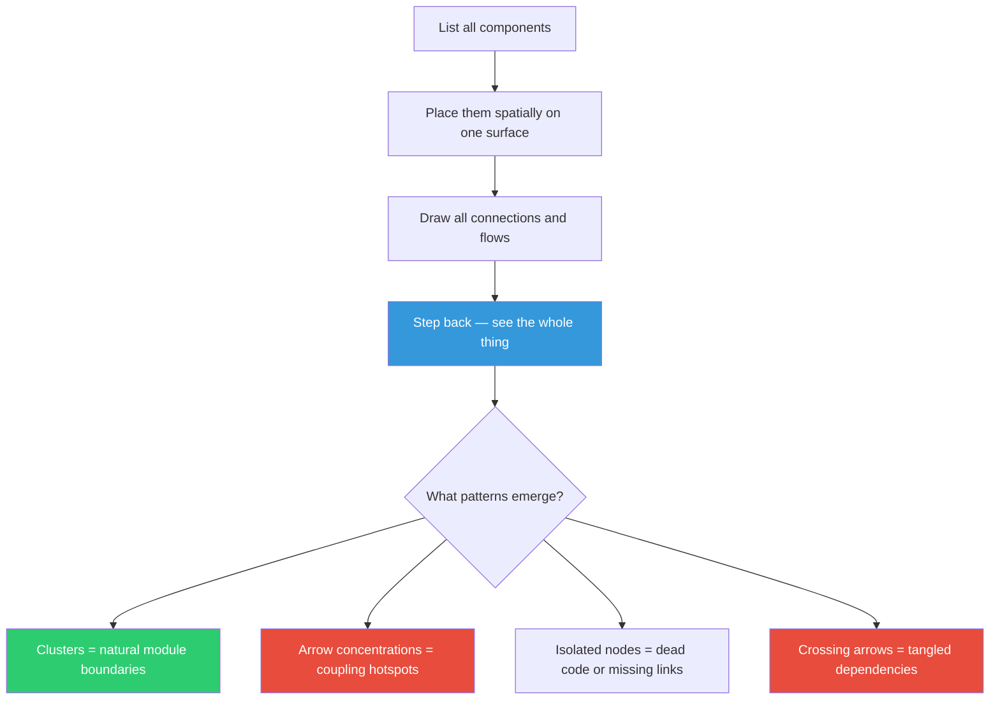

## The Move

Take your system — the modules, services, data flows, user journeys, whatever you're working on — and create a representation where every part is visible simultaneously on one screen or one wall. Not a document you scroll through. Not a list you read top-to-bottom. A spatial layout where position and proximity encode relationships. Use a whiteboard, a diagramming tool, sticky notes on a wall, or a single wide canvas. Place components and draw connections. Now step back and look at the whole thing. What clusters appear? Where do the arrows concentrate? What's isolated that shouldn't be? What's connected that shouldn't be? The patterns that emerge from the spatial view are invisible in any sequential representation.

## When to Use

- You're planning a system with more than 5 interacting components
- You keep discovering unexpected dependencies after making changes
- A document or spec exists but nobody has the whole picture in their head
- You need to communicate architecture to someone new and walls of text aren't working

## Diagram

## Example

**Situation:** A team is building a microservices backend with 12 services. The architecture exists as a series of README files in each repo. Deployments keep causing cascading failures, but nobody can predict which service will break when another changes.

**Seeing the whole thing at once:** The tech lead takes a large whiteboard and places each service as a card. She draws every synchronous call as a red arrow and every async message as a blue arrow. She adds the database each service owns as a cylinder underneath it. The whole thing takes 30 minutes.

**What the spatial view revealed:** Three things were immediately visible that no amount of README reading had surfaced: (1) The "user service" had red arrows from 9 of 12 other services — it was a single point of failure nobody had named. (2) Two services that "shouldn't know about each other" (billing and notifications) both wrote to the same shared database table — a hidden coupling. (3) The event bus had only 3 subscribers despite 8 services publishing to it — most async messages were going nowhere. The team reprioritized their entire quarter based on 30 minutes of drawing.

## Watch Out For

- The map is not the territory. Your whole-system view is a model — it will be incomplete. That's fine. The point is to see patterns, not to be exhaustive
- Resist the urge to make it pretty. A rough sketch on a whiteboard that takes 20 minutes beats a polished diagram that takes 2 days
- Update it or throw it away. A stale architecture diagram is worse than none — it provides false confidence. If you can't commit to updating it, treat it as a disposable thinking tool
- Don't put too much on one view. If you need to show data flows AND deployment topology AND user journeys, those are three separate views, not one cluttered diagram
