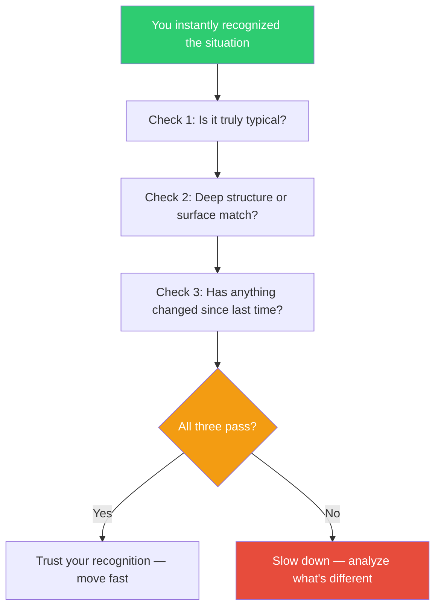

## The Move

You recognized this situation instantly and already know what to do. That's often expertise working correctly — Klein's research shows experts are right most of the time. But before you act, run three checks. (1) Typicality: is this situation truly typical, or does it have one anomalous feature you're glossing over? Name the features you matched on and look for one that doesn't fit. (2) Depth: are you recognizing the deep structure or just the surface? State the underlying mechanism — if you can't, you're matching on appearances. (3) Recency: has anything changed since the last time you saw this pattern? New tools, new constraints, new team, new scale. If all three pass, trust your recognition and move fast. If any one fails, slow down.

## When to Use

- You immediately knew the answer and are about to execute without analysis
- A problem feels like a standard pattern you've handled before
- You're an expert in this area and your intuition is firing strongly
- You need to decide whether to go fast (trust the pattern) or slow (analyze further)

## Diagram

## Example

**Situation:** A production alert fires at 2 AM — high latency on the checkout service. You've seen this before: the database connection pool is exhausted. You reach for the playbook: restart the service, bump the pool size.

**Check 1 — Typicality:** The latency pattern looks the same, but the error rate is lower than usual. Normally connection pool exhaustion causes errors, not just slowness. One anomalous feature.

**Check 2 — Deep structure:** Connection pool exhaustion happens because queries hold connections too long. But you haven't checked whether queries are actually slow — you're matching on the symptom (high latency) not the mechanism (long-running queries).

**Check 3 — Recency:** Last week the team deployed a new payment provider integration. That didn't exist the last time this pattern appeared.

**Result:** Check 1 and 3 fail. You slow down, check the query logs, and discover the new payment provider's webhook endpoint is making synchronous calls back to your service, creating a circular dependency that wasn't there before. Restarting the service would have provided temporary relief and masked the real problem.

## Watch Out For

- This move is not anti-intuition. Klein's whole point is that expert intuition is powerful and usually right. The three checks exist to catch the 10-20% of cases where it's wrong
- If you're a genuine novice in the domain, pattern recognition isn't expertise — it's guessing. This move is for situations where you have real experience
- The biggest danger is Check 2 failing silently. You feel like you understand the deep structure, but you're actually matching on surface features. Forcing yourself to state the mechanism out loud catches this
- Don't let the checks become a ritual that slows you down on everything. Reserve them for decisions with real consequences
