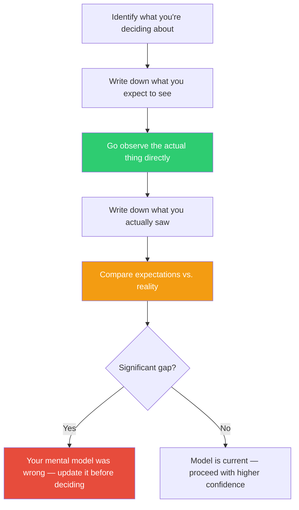

## The Move

Identify the thing you're making decisions about — the user flow, the production system, the deployment pipeline, the support queue. Now go look at it directly. Not the dashboard. Not the summary. Not someone else's description. The actual thing. Watch a real user use the product and don't intervene. Read the raw error logs, not the aggregated report. Trace one real request through the entire system. Sit with the support team and listen to actual tickets. Before you go, write down what you expect to see. After, write down what you actually saw. The gap between those two lists is where your mental model has drifted from reality. That drift is where your worst decisions come from.

## When to Use

- You're making a decision based on a model of reality you haven't verified recently
- The team is debating what users want or how the system behaves without anyone having checked
- You're planning a change to a system you haven't personally observed in months
- Metrics say one thing but anecdotal reports say another
- You're stuck and suspect the problem is different from what you think it is

## Diagram

## Example

**Situation:** The team is planning a redesign of the settings page. The product manager says it's confusing. Analytics show low engagement. The design proposal reorganizes everything into tabs.

**Go and see:** You sit behind three users (with permission) and watch them use the settings page. You expected confusion and fumbling.

**What you actually see:** Users aren't confused by the layout. They find the setting they want quickly. The problem is that after changing a setting, there's no confirmation — no save button, no toast, no visual change. Users change the setting, see nothing happen, assume it didn't work, and change it again. Some toggle the setting back and forth three times. The "low engagement" in analytics is actually users successfully completing the task but the event not firing because the save is debounced.

**The gap:** The problem isn't information architecture. It's feedback. The tab redesign would have been wasted effort. A simple confirmation toast fixes the actual problem. You would never have discovered this from the dashboard.

## Watch Out For

- "Go and see" doesn't mean "glance at it." It means sustained, attentive observation. Fifteen minutes of watching a user is worth more than a week of debating in a meeting
- Your presence changes what you observe (Hawthorne effect). When watching users, be as invisible as possible. When observing systems, prefer passive observation (logs, traces) over active probing that changes behavior
- This move is deceptively simple and chronically under-used. Teams will spend days in meetings debating what a system does instead of spending 30 minutes looking at it. The bias toward abstraction over observation is powerful
- Going to see once is good. Going regularly is transformative. The best engineering leaders maintain direct contact with production systems, real users, and frontline support — not as a one-time exercise but as a habit
