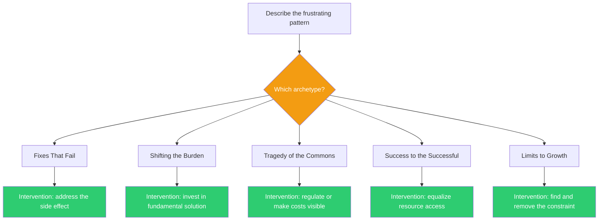

## The Move

Describe the frustrating pattern in two sentences. Then check it against these five classic system archetypes: (1) FIXES THAT FAIL — your fix creates a side effect that regenerates the original problem, so you need more of the fix. (2) SHIFTING THE BURDEN — you're treating symptoms with a quick fix while the fundamental solution atrophies from disuse. (3) TRAGEDY OF THE COMMONS — a shared resource is being depleted because each user takes what's rational for them individually. (4) SUCCESS TO THE SUCCESSFUL — two activities compete for resources, the early winner gets more resources, and the gap widens irreversibly. (5) LIMITS TO GROWTH — rapid improvement hits a constraint that slows or reverses the gains. Pick the archetype that fits. Each has a known intervention: (1) stop the fix, address the side effect; (2) invest in the fundamental solution; (3) regulate the commons or make costs visible; (4) equalize resource access; (5) identify and remove the limiting factor.

## When to Use

- A problem keeps recurring despite repeated fixes
- Initial success is fading and you don't understand why
- The team is working harder but outcomes are getting worse
- You sense a structural pattern but can't articulate it
- You need to explain a systemic problem to someone who thinks it's a simple issue

## Diagram

## Example

**Pattern:** "Our microservices keep having integration issues. Each time, we add more integration tests. The test suite now takes 45 minutes. Developers avoid running it locally. They push to CI and context-switch. CI queues grow. People batch more changes per push to avoid the wait. Larger batches cause more integration issues."

**Archetype match: FIXES THAT FAIL.**

The fix (more integration tests) creates a side effect (slow test suite) that causes larger batches, which regenerates the original problem (integration issues). Each round of "add more tests" makes the cycle worse.

**Intervention:** Stop adding more tests of the same kind. Address the side effect: make the test suite fast (parallel execution, test splitting, contract tests instead of full integration tests) or eliminate the need for large-scale integration testing (trunk-based development with feature flags, better API contracts). The constraint isn't test coverage — it's test speed.

## Watch Out For

- Most situations match multiple archetypes. Pick the one that fits the DOMINANT dynamic, not the one that's most intellectually interesting
- The archetypes are models, not laws. They point you toward the right kind of intervention, but the specific fix still requires domain knowledge
- Naming the archetype is satisfying but insufficient. The value comes from identifying the specific intervention point for YOUR instance. "We're in a Limits to Growth pattern" is the starting point, not the conclusion
- Some patterns are combinations — e.g., Shifting the Burden often coexists with Fixes That Fail. If one archetype doesn't fully explain the behavior, check if two archetypes are interacting
- People embedded in the system often resist the archetype diagnosis because it implies their current approach is structurally counterproductive. Present it as a system property, not a criticism of individuals
