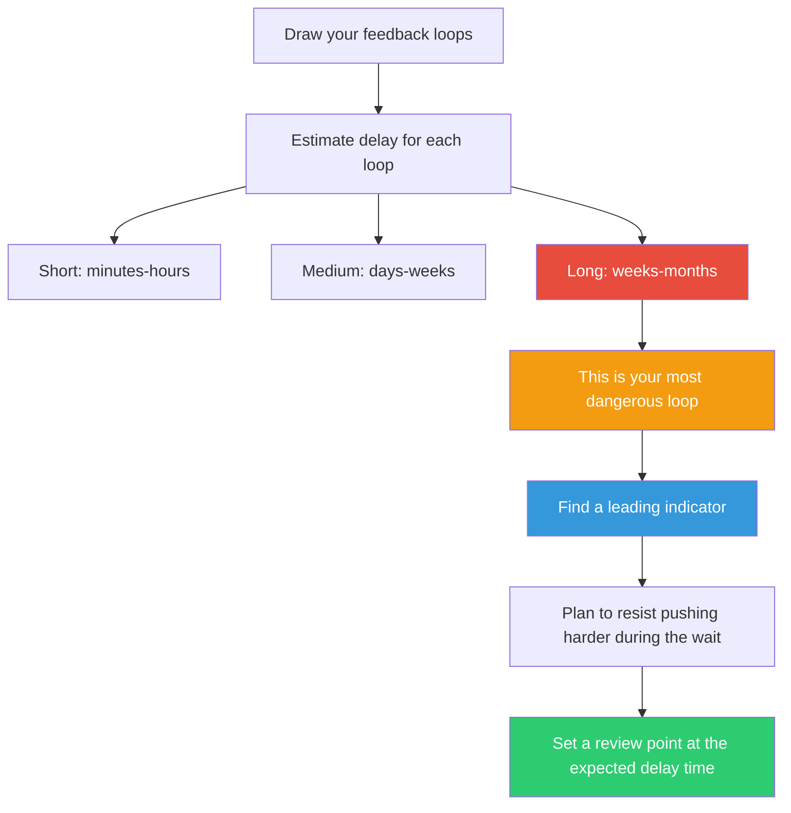

## The Move

Draw your system's key feedback loops — or pull them from a prior Feedback Loop Audit (TF-030). For each loop, estimate the delay: how long between taking an action and seeing its effect complete the circuit? Label each loop: short delay (minutes to hours), medium (days to weeks), or long (weeks to months). Now find your longest-delay loop. That's your most dangerous feature. Long delays cause overshoot — you keep pushing because you haven't seen results yet, then all the results arrive at once. For your longest-delay loop, answer: (1) How will you know your intervention is working before the results arrive? (2) What's the leading indicator that appears before the lagging result? (3) What's your plan to resist pushing harder during the waiting period?

## When to Use

- You made a change and are tempted to make more because "nothing is happening"
- The system oscillates — too much, then too little, then too much again
- You're planning an intervention and need to set realistic expectations for when results appear
- Post-mortem reveals that the team overreacted because they couldn't see the effects of what they'd already done
- You're in a domain ({{domain.1}}) where delay structures are unfamiliar to you

## Diagram

## Example

**Situation:** An engineering team's velocity is dropping. Management decides to invest in developer experience (DX) — better tooling, faster CI, upgraded dev environments.

**Feedback loops and delays:**

- **Loop 1 (short delay):** Developer commits code, CI runs, developer sees result. Delay: 20 minutes. Improving CI from 20 minutes to 5 minutes shows results immediately. This loop is fast and safe.
- **Loop 2 (medium delay):** Better DX leads to less friction leads to higher velocity leads to more feature throughput. Delay: 2-4 weeks. Developers need to adopt new tools, change habits, and accumulate compound savings.
- **Loop 3 (long delay):** Higher velocity leads to more shipped features leads to user growth leads to business confidence leads to continued DX investment. Delay: 2-3 months. Business results lag engineering improvements significantly.

**Longest delay: Loop 3.** The danger: management invests in DX for a month, doesn't see business metrics improve, concludes "DX investment doesn't work," and cuts the budget — right when the compounding effects were about to appear.

**Leading indicator:** Track deploys-per-week (Loop 1, visible in days) as a proxy for the eventual business impact (Loop 3, visible in months). Show this metric to leadership weekly so they see progress before the lagging results arrive.

**Overshoot plan:** Set a 3-month evaluation point. Agree in advance that no changes to DX investment will be made before that date, regardless of business metrics.

## Watch Out For

- The most common mistake with delays is impatience. You apply an intervention, see no result, double the intervention, and then both doses arrive simultaneously. This is how companies over-hire and then lay off in cycles
- Delays are not constant. Under load, delays often increase — making the overshoot problem worse precisely when the system is most stressed
- Short-delay loops feel controllable. Long-delay loops feel random. They're not random — you just can't see the causation because the effect is separated from the cause by time
- The fix for delay isn't to remove the delay (often impossible) but to find leading indicators that give you early signal within the delay period. Every long-delay loop has a shorter-delay proxy if you look carefully enough
- Beware of "dead time" — delays where literally nothing observable happens between action and effect. These are the hardest to manage because there's no leading indicator at all. In these cases, your only defense is patience and a pre-committed evaluation timeline
