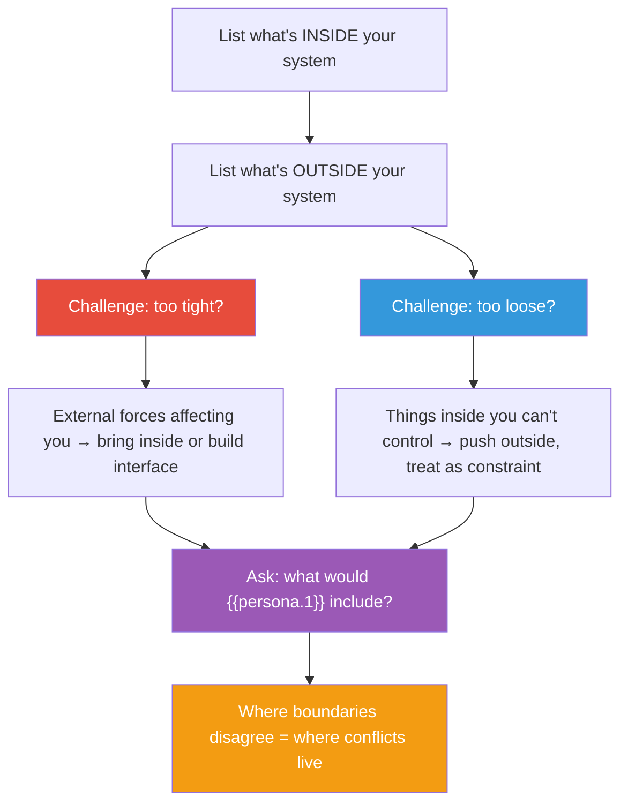

## The Move

Draw your system boundary explicitly. List what's INSIDE (components, teams, processes you control) and what's OUTSIDE (dependencies, users, market forces, other teams you don't control). Now challenge the boundary in both directions. Too tight: what forces outside your boundary keep affecting your outcomes? Those probably need to come inside — either you take control of them or you build explicit interfaces to monitor them. Too loose: what's inside your boundary that you're trying to control but actually can't? That's wasted effort — push it outside and treat it as an environmental constraint. Finally, ask: what would **{{persona.1}}** include inside the boundary that you left out? Their boundary would be different because their purpose is different. Where their boundary and yours disagree is where misalignment and conflict live.

## When to Use

- A project keeps being disrupted by things "outside scope" that you should have planned for
- Scope creep is happening and you need to define what's in and what's out
- Two teams or functions disagree about ownership of a problem
- You're trying to control something and failing because it's genuinely outside your influence
- You're about to plan a project and need to establish what you're responsible for

## Diagram

## Example

**Situation:** A platform team is responsible for the internal developer platform — CI/CD, infrastructure provisioning, and observability tooling. Developers keep complaining about slow onboarding.

**Initial boundary:**

- **Inside:** CI/CD pipelines, Terraform modules, monitoring dashboards, deployment tooling.
- **Outside:** Developer laptops, IDE setup, documentation, team-specific workflows, hiring.

**Challenge — too tight?** Developer onboarding keeps failing not because the platform is bad, but because the local dev environment doesn't match production. Laptop setup, IDE configuration, and "how to run this locally" are outside the platform team's boundary but directly cause the complaints they're receiving. The boundary needs to expand to include the local development experience, or at minimum, the team needs an explicit interface: a supported dev container or Codespace that bridges the gap.

**Challenge — too loose?** The platform team is trying to enforce coding standards through CI linting rules. But coding standards are owned by the engineering org, not the platform team. They're burning political capital trying to control something outside their real authority. Push it outside: provide the linting infrastructure, let engineering leadership own the rules.

**{{persona.1}} boundary:** Say the persona is "a first-week junior engineer." Their system boundary includes everything from "I accepted the job offer" to "I shipped my first PR." The platform team's boundary is a subset of this. The junior engineer would include HR onboarding, buddy assignment, and "finding the right Slack channel" — none of which the platform team controls, all of which affect the outcome they're measured on.

**Insight:** The platform team needs to either expand their boundary to own the full developer onboarding experience (bigger scope, more impact) or explicitly partner with the teams that own the pieces outside their boundary (less scope, shared accountability). The current situation — being responsible for the outcome but not owning the inputs — is a structural trap.

## Watch Out For

- There is no objectively correct boundary. Boundaries are chosen based on purpose. A security team, a product team, and an infrastructure team will draw different boundaries around the same system, and all three can be valid
- The most dangerous boundary error is excluding something that's actually inside your system because you don't want to deal with it. If it affects your outcomes, it's inside your system whether you acknowledge it or not
- Meadows warns that boundaries are artificial — "there are no separate systems." But you have to draw them somewhere to act. The key is to draw them consciously and revisit them when reality pushes back
- Scope creep is often a boundary drawn too tight. The things that keep creeping in are things that were always inside the real system — you just drew the line in the wrong place initially
