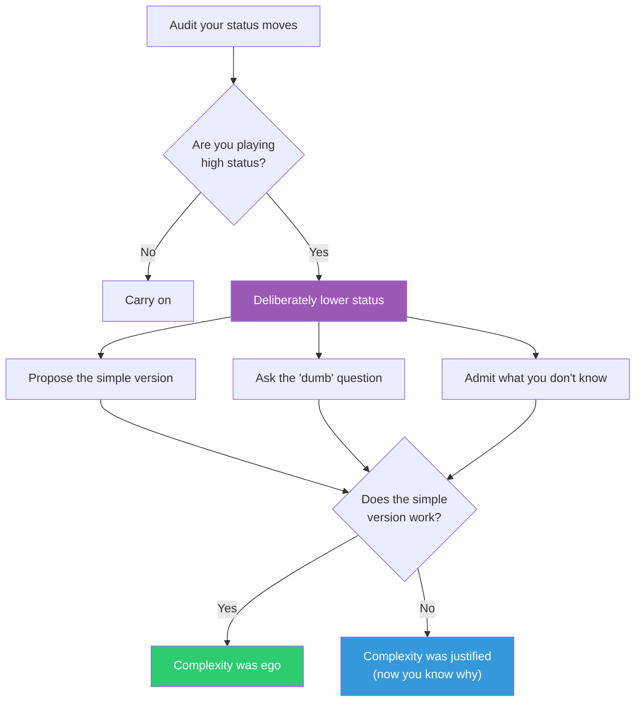

## The Move

{{thinker.1}} is watching your work. Are you performing competence or actually being useful? Pause and audit your status moves. High-status technical moves include: using jargon when plain language works, reaching for complex architectures, dismissing simpler alternatives as "naive," assuming expertise you haven't verified, and over-engineering for hypothetical scale. Now deliberately lower your status. Do one of these: (1) propose the embarrassingly simple version out loud, (2) ask a question you're afraid sounds dumb, (3) admit specifically what you don't know about this problem, or (4) describe your solution without any technical vocabulary. If the low-status version works, the complexity was ego, not engineering.

## When to Use

- You're choosing between a simple and a complex approach and leaning complex
- A design review feels like a performance rather than a collaboration
- You notice jargon acting as a shield rather than a shorthand
- Nobody on the team is voicing disagreement or asking basic questions
- You suspect the architecture is more impressive than necessary

## Diagram

## Example

**Situation:** A senior engineer proposes a distributed event-sourcing system for a new internal tool that currently has 12 users. The architecture involves Kafka, a CQRS pattern, event replay, and eventual consistency. The presentation is polished. Nobody pushes back.

**Lower your status:** "I might be missing something, but could we just use a PostgreSQL table with timestamps and a simple REST API? What would break?"

**What happens:** The room goes quiet. Then someone says, "Actually... nothing would break. We'd need to migrate later if we hit scale, but we're 18 months from that." The distributed system was high-status engineering for a low-status problem. The Postgres version ships in a week instead of three months.

**Key insight:** The senior engineer wasn't being dishonest — they genuinely believed the complex version was better. High-status moves are often invisible to the person making them. The low-status question made the mismatch visible.

## Watch Out For

- Lowering status is not self-deprecation. It's deliberately removing the armor of expertise to see the problem clearly. You're still competent — you're choosing honesty over performance
- In organizations that reward complexity, lowering your status can feel risky. It is. But the cost of unnecessary complexity is higher
- Don't weaponize this against others ("you're just playing high status"). Use it as a self-audit, not an accusation
- Sometimes the complex solution IS the right one. The move is to verify that, not to always choose simplicity. If you lower your status and the simple version genuinely doesn't work, you've learned why the complexity is necessary — which is valuable
