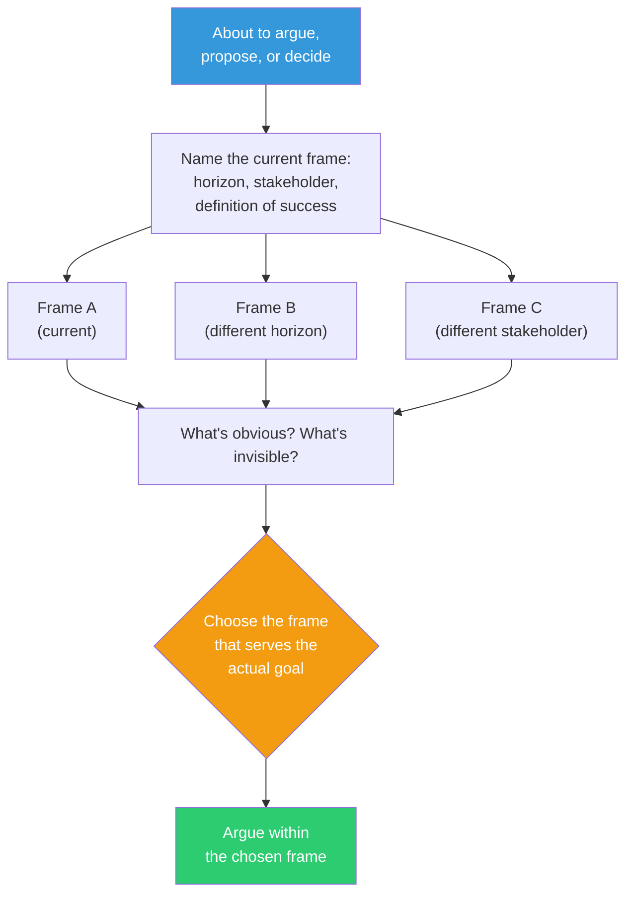

## The Move

Before you present an argument, proposal, or solution, stop. Write down the frame you are currently operating in — what coordinates, time horizon, stakeholders, and definition of success are assumed. Then write two alternative frames: a different time horizon, a different stakeholder's perspective, a different definition of success. For each frame, note what solutions become obvious and what solutions become invisible. Choose the frame deliberately, then proceed.

The person who sets the frame controls the conversation before a word is spoken. If you let someone else frame it, you are playing their game.

## When to Use

- You are preparing a proposal or presentation and want to control the narrative
- A discussion is stuck and participants are arguing past each other
- You realize the question itself is biased toward a particular answer
- Two teams disagree and the disagreement seems emotional but is actually about framing

## Diagram

## Example

**Situation:** The team is debating whether to rewrite the payment service in a new language.

**Frame A (Engineering efficiency):** "Will this make the codebase easier to maintain?" This frame makes the rewrite look appealing — cleaner code, better tooling, modern patterns.

**Frame B (Business risk):** "What is the probability-weighted cost of a payments outage during migration?" This frame makes the rewrite look terrifying — payments is the highest-risk surface area.

**Frame C (Talent):** "Can we hire for the current stack in 2 years?" This frame makes the rewrite look inevitable — the talent pool for the current language is shrinking.

**Observation:** The team was stuck because half were using Frame A and half Frame B. Nobody had named Frame C, which actually resolves the debate: the rewrite is necessary (Frame C) but should be phased to manage risk (Frame B). Frame A was the least useful frame — it was the most comfortable but the least strategic.

**Decision:** Adopt Frame C as the primary lens, constrained by Frame B. Plan a phased migration, not a big-bang rewrite.

## Watch Out For

- This can become manipulative. The goal is to choose the most truthful and useful frame, not the one that just wins the argument
- Naming someone else's frame out loud can feel confrontational. Do it with curiosity ("I think we're framing this as X — what if we framed it as Y?"), not accusation
- Every frame excludes something. When you choose a frame, be explicit about what you are choosing not to see
- Don't spend so long framing that you never get to the substance. Two minutes of frame-setting saves twenty minutes of argument, but twenty minutes of frame-setting is procrastination
