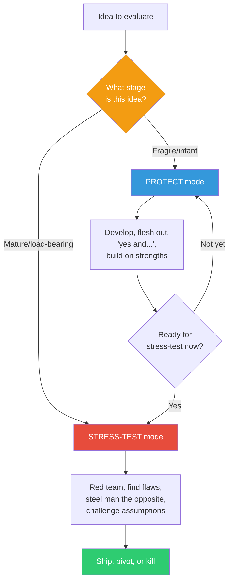

## The Move

Before evaluating any idea, ask one question first: "Is this idea still fragile, or is it load-bearing?" If fragile (just born, half-formed, has potential but no structure), protect it — develop it further, flesh it out, build on it, say "yes, and..." If load-bearing (fleshed out, about to be committed to, resources are about to be spent), attack it — red team it, find the flaws, steel man the opposite, ask what would have to be true. Write down which stage the idea is in before anyone evaluates it. The wrong force at the wrong time either kills good ideas (criticism too early) or ships bad ones (nurture too late). Think of it in terms of a timeline: where are you — closer to **{{stage.1}}** from now, or already at the decision point?

## When to Use

- Before any idea review meeting, to set the right mode
- When you notice a brainstorm turning adversarial too quickly
- When an idea has been nurtured for a long time and nobody has challenged it
- When you feel defensive about an idea and want to know if that's appropriate or a warning sign

## Diagram

## Example

**Situation:** An engineer proposes using event sourcing for the new order management system during a design review.

**Wrong approach:** Immediately red-teaming: "Event sourcing is complex, the team has no experience, the storage costs will be high, what about GDPR deletion requirements?" The idea dies in 3 minutes.

**Right approach using Protect Then Stress-Test:**

**Stage check:** The idea is 5 minutes old. It's fragile. Protect first.

**Protect phase (15 minutes):** "What problems would event sourcing solve that our current approach can't? What would the ideal version look like? What would we gain from a complete audit trail? How would replay capability change our debugging story?" The idea develops structure and clear benefits.

**Stage check again:** Now the idea has concrete benefits (audit trail, debugging via replay, temporal queries) and a rough architecture. It's no longer fragile. Switch to stress-test.

**Stress-test phase (15 minutes):** "What's the learning curve cost? How do we handle GDPR right-to-deletion? What's the storage projection at 10x current volume? Can we hire for this skill?" The idea is now challenged on its merits, not killed in its crib.

**Result:** The team adopts event sourcing for the audit-critical order state transitions but keeps CRUD for the rest. A nuanced outcome that neither pure protection nor pure attack would have produced.

## Watch Out For

- "Protect" does not mean "agree." It means "develop the idea to the point where criticism is meaningful." You can protect an idea you personally dislike
- Some people default to protect mode always (conflict-avoidant teams) and some to attack mode always (adversarial cultures). Know your team's bias and compensate
- Don't use "it's still fragile" as a shield forever. At some point, resources will be committed and the idea must face scrutiny. Set a deadline for the transition
- The stage is a property of the idea, not the person. Telling someone "your idea is fragile" can feel condescending — instead, say "let's develop this further before we challenge it"
