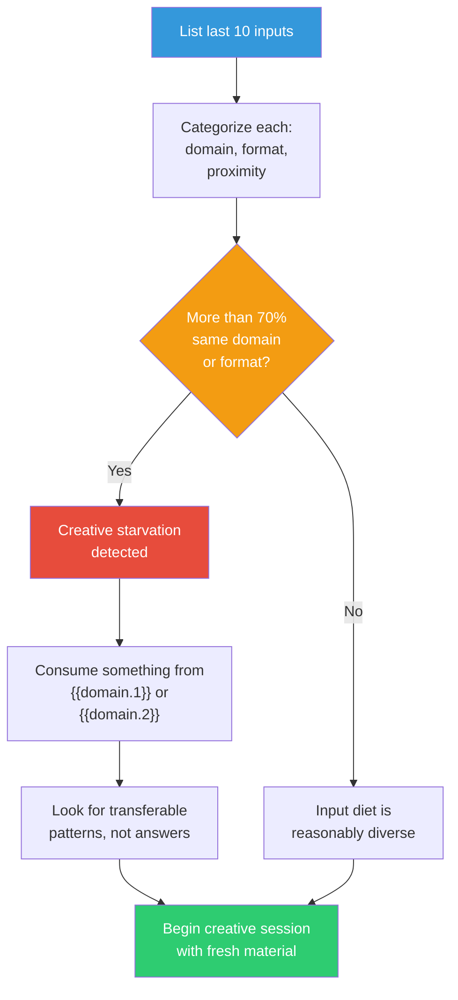

## The Move

List the last ten things you read, studied, or absorbed related to this project. Categorize each by domain, format (doc, code, article, conversation, video), and source proximity (your own field, adjacent field, distant field). If more than 70% come from the same domain or format, your creative diet is deficient — your outputs will be a diluted version of your inputs. Before your next creative session, deliberately consume something from **{{domain.1}}** or **{{domain.2}}**. You are not looking for answers in these domains; you are looking for patterns, metaphors, and structural shapes that your mind will recombine with your actual problem.

Your creative metabolism works like digestion: input quality determines output quality, with a 20% discount. If you feed yourself mediocre inputs, your best ideas will be 20% worse than mediocre.

## When to Use

- Before a major creative or design session
- When your team's ideas all sound the same
- When you feel like you're recycling other people's solutions
- Periodically as a creative hygiene check

## Diagram

## Example

**Situation:** A team is designing a recommendation engine for an internal knowledge base. They've been reading about recommendation algorithms for three weeks.

**Input audit:**
1. Netflix recommendation system paper (tech / article / same field)
2. Spotify Discover Weekly blog post (tech / article / same field)
3. Collaborative filtering textbook chapter (tech / book / same field)
4. Internal knowledge base usage data (tech / data / same field)
5. Competitor analysis of three similar tools (tech / report / same field)
6. YouTube recommendation algorithm deep dive (tech / video / same field)
7. ML model comparison benchmark (tech / paper / same field)
8. Team discussion about ranking (tech / conversation / same field)
9. Product requirements doc (tech / doc / same field)
10. Stack Overflow thread on vector similarity (tech / forum / same field)

**Diagnosis:** 10/10 same domain, 100% tech sources. The team is going to build a slightly worse version of Netflix recommendations for documents.

**Prescription:** Before the next design session, spend 30 minutes with:
- **{{domain.1}}:** How does a librarian help someone who doesn't know what they're looking for? (Pattern: reference interview, iterative refinement of the question itself)
- **{{domain.2}}:** How do curators decide what goes next to what in an exhibition? (Pattern: adjacency as narrative, context determines meaning)

**Result:** The librarian pattern suggests the system should help users *refine their question*, not just answer it. The curation pattern suggests that *what you show next to a result* changes its meaning. Neither insight would emerge from reading more recommendation algorithm papers.

## Watch Out For

- This is not an excuse to procrastinate by reading widely instead of doing the work. Time-box the input phase — 30 minutes of diverse input, not three days
- The distant domain inputs need to be genuinely engaged with, not skimmed. You need to understand how {{domain.1}} actually thinks, not just grab a surface metaphor
- Some projects genuinely require deep domain expertise. Don't dilute critical domain study with random cross-pollination when you need to go deeper, not wider
- This move works best for creative and design challenges. For debugging or optimization, deep domain focus is usually correct
