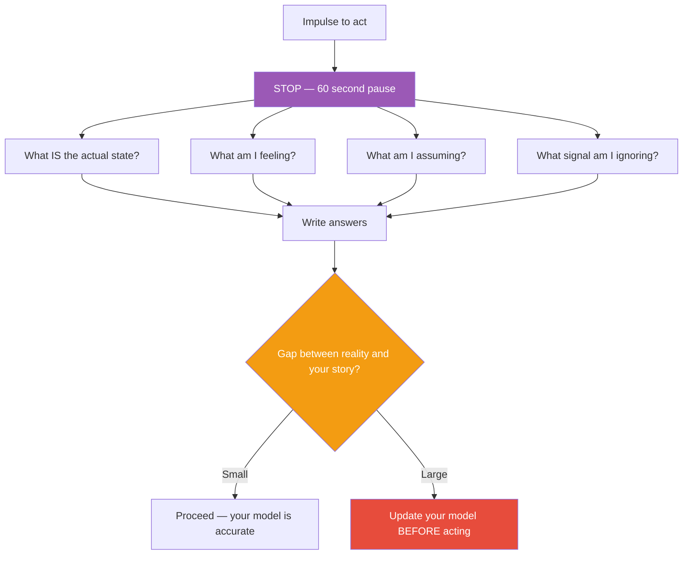

## The Move

Stop. Set a 60-second timer. Do not plan, do not solve, do not discuss. Just notice. Answer these four questions in writing: (1) What is the actual state of the system right now — not what it should be, what it IS? (2) What am I feeling — urgency, confusion, excitement, dread? (3) What am I assuming that I have not verified? (4) What signal am I currently ignoring because it's inconvenient? After 60 seconds, read your answers. The gap between your answers and the story you were telling yourself before the pause — that gap is where mistakes are born. Close the gap before acting.

## When to Use

- You are about to start a sprint, project, or debugging session
- You feel the urge to act immediately and cannot explain why
- The last decision turned out to be based on a false assumption
- The team is in firefighting mode and nobody has paused to assess

## Diagram

## Example

**Situation:** Production is throwing 500 errors. The on-call engineer is about to roll back the last deploy.

**Awareness pause (60 seconds):**
1. **Actual state:** Error rate is 2.3% (up from 0.1%). Only hitting the `/api/search` endpoint. Last deploy was 3 hours ago. Errors started 20 minutes ago.
2. **Feeling:** Urgency. Panic. The Slack channel has 40 messages.
3. **Assumptions:** "The last deploy caused this." But the deploy was 3 hours ago and errors started 20 minutes ago. That's a 2-hour-40-minute gap. Why would a deploy cause errors with a delay?
4. **Ignoring:** The search endpoint depends on an external Elasticsearch cluster. Nobody has checked ES health.

**What the pause revealed:** The assumption "last deploy caused this" does not fit the timeline. A 60-second check of the ES cluster shows it is in a degraded state due to a node failure. Rolling back the deploy would have wasted 30 minutes and not fixed the problem.

**Result:** Instead of a pointless rollback, the engineer restarts the failed ES node and errors clear in 2 minutes. The pause saved 30 minutes and a red-herring investigation.

## Watch Out For

- 60 seconds feels like an eternity when you are under pressure. That is exactly when this move is most valuable. The urgency you feel is often the urgency to act on an assumption, not the urgency of the actual situation
- This is not meditation or mindfulness theater. It is a concrete diagnostic: 4 questions, written answers, 60 seconds. Do not turn it into a 20-minute reflection
- If you do this and your model was already accurate, good — you lost 60 seconds and gained confidence. The cost of the check is always lower than the cost of acting on a false model
- Do not use this as a procrastination tool. The timer is 60 seconds, not "until I feel ready." Notice, then act
