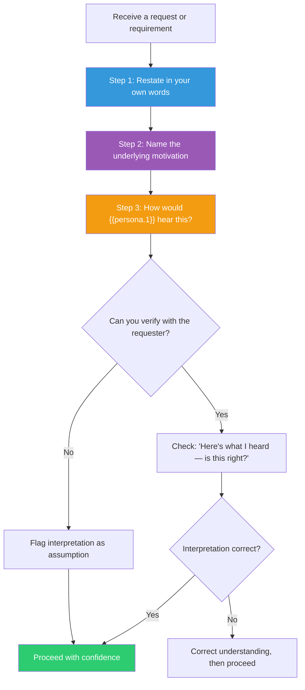

## The Move

Before acting on any requirement, feedback, bug report, or user request, perform a three-step audit. (1) RESTATE: write what you heard in your own words. Not a copy-paste — a genuine paraphrase that proves comprehension. (2) NAME THE MOTIVATION: write one sentence about WHY you think they are asking for this. What is the underlying need, pain, or goal behind the literal request? (3) CHECK: if possible, verify your restatement with the requester. If not, flag your interpretation as an assumption.

Then apply the persona lens: imagine {{persona.1}} heard the same request. What would they focus on? What would they interpret differently? The gap between your interpretation and theirs reveals your blind spots.

## When to Use

- Before starting work on any externally-sourced requirement
- When you receive feedback that feels contradictory or confusing
- After a meeting where decisions were made — restate what was decided before acting
- When a bug report or support ticket feels ambiguous

## Diagram

## Example

**Request from product manager:** "The dashboard is too slow. Can you add caching?"

**Step 1 — Restate:** "The dashboard page load is unacceptably slow for users, and you believe adding a caching layer would fix it."

**Step 2 — Name the motivation:** "You're getting complaints from customers (or you noticed it yourself), and the slowness is hurting user trust or adoption. You suggested caching because it's a familiar solution, but the core need is: make the dashboard fast."

**Step 3 — Persona lens ({{persona.1}}):** A security engineer would hear "add caching" and immediately ask: "Caching WHERE? Client-side caching of sensitive dashboard data is a security risk. Are we caching per-user or shared? What about cache invalidation when permissions change?" This surfaces concerns you might have missed.

**Verification:** "Hey, I want to make sure I understand. The core problem is dashboard load time, not specifically caching — if I can make it fast without caching (say, query optimization), is that equally good? And are the complaints from specific customers or is this across the board?"

**PM's response:** "Actually, it's mainly the analytics widgets. The rest of the dashboard loads fine. And yes, any fix works — I just assumed caching was the answer."

The Active Listening Audit just prevented you from building a caching layer for the entire dashboard when the real problem was three slow SQL queries powering the analytics widgets.

## Watch Out For

- Restating is not parroting. "You want caching" is a copy. "You want the dashboard to be faster and you think caching would help" is a restatement that separates the need from the proposed solution
- Naming the motivation requires empathy, not mind-reading. You are forming a hypothesis about why, not claiming to know. State it as a hypothesis
- The persona lens is most valuable when the persona has a very different perspective from yours. A designer, a security auditor, and an end user will hear the same request differently
- Do not skip the verification step when it is possible. Five minutes of clarification saves days of building the wrong thing
- This move feels slow and awkward the first few times. It gets fast with practice and pays for itself immediately
