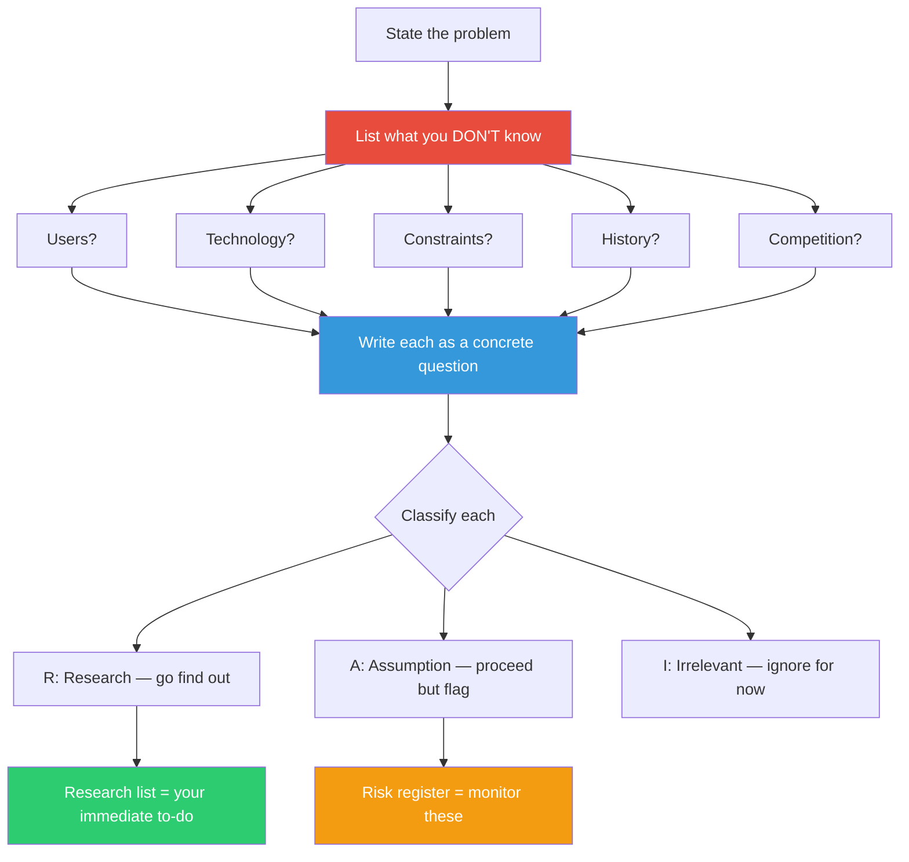

## The Move

Take your current problem and systematically list what you do NOT know. Not what you are uncertain about — what you are completely ignorant of. Use these prompts: What don't I know about the USERS? The TECHNOLOGY? The CONSTRAINTS? The HISTORY (why is it this way)? The COMPETITION (who else solved this)? How would someone from {{domain.1}} or {{domain.2}} see gaps I am missing?

Write each unknown as a concrete question, not a vague topic. "I don't know about performance" is vague. "I don't know what our P95 latency is under peak load" is a question you can answer. Once you have the list, classify each item: (R) research task — go find out before proceeding; (A) assumption to flag — proceed but mark as unverified; (I) irrelevant — you do not need to know this right now. The R items become your immediate to-do list. The A items go into your risk register.

## When to Use

- At the start of any project, before committing to an approach
- When your confidence feels higher than your knowledge justifies
- After a surprise or failure — to catalog what you did not know and should have
- When entering an unfamiliar domain or working with unfamiliar technology

## Diagram

## Example

**Problem:** "Migrate our monolith's authentication system to a standalone auth service."

**Ignorance inventory:**

| # | I don't know... | Type |
|---|----------------|------|
| 1 | How many services currently call the auth module directly (not through the API) | R |
| 2 | Whether any service stores auth tokens in its own database | R |
| 3 | What the session expiry behavior is — is it sliding window or fixed? | R |
| 4 | How the auth system handles the mobile app's refresh token flow | R |
| 5 | Why the auth module was originally built into the monolith instead of separate | A |
| 6 | Whether there are compliance requirements (SOC2, GDPR) that constrain how auth data can be moved | R |
| 7 | What auth libraries or frameworks the team has experience with | A |
| 8 | How competitors handle auth service migration at our scale | I |
| 9 | What the peak authentication rate is (logins per second at peak) | R |

**Result:** Six research tasks surfaced before writing a single line of migration code. Item 6 (compliance requirements) turned out to be the most critical — there were data residency constraints that would have invalidated the team's initial architecture. Item 2 revealed that two services had duplicated auth token storage, creating a consistency problem nobody knew about.

Without this inventory, the team would have discovered these issues mid-migration, at much higher cost.

## Watch Out For

- Listing unknowns requires intellectual honesty. Your ego wants to minimize the list. Fight that — a longer list is a safer project
- Do not confuse uncertainty with ignorance. "I'm not sure if Redis can handle our load" (uncertainty — you have some data) is different from "I don't know what our load is" (ignorance — you have no data). This move targets ignorance
- The "irrelevant" classification is dangerous. Be careful about dismissing unknowns as irrelevant — they may become relevant later. When in doubt, classify as A (assumption) rather than I (irrelevant)
- This move pairs naturally with the start of a project but is also valuable mid-project, especially after a surprise. Surprises reveal that your ignorance inventory was incomplete
- Do not let the list paralyze you. Not everything needs to be researched before starting. The classification step (R/A/I) is what makes the list actionable rather than overwhelming
