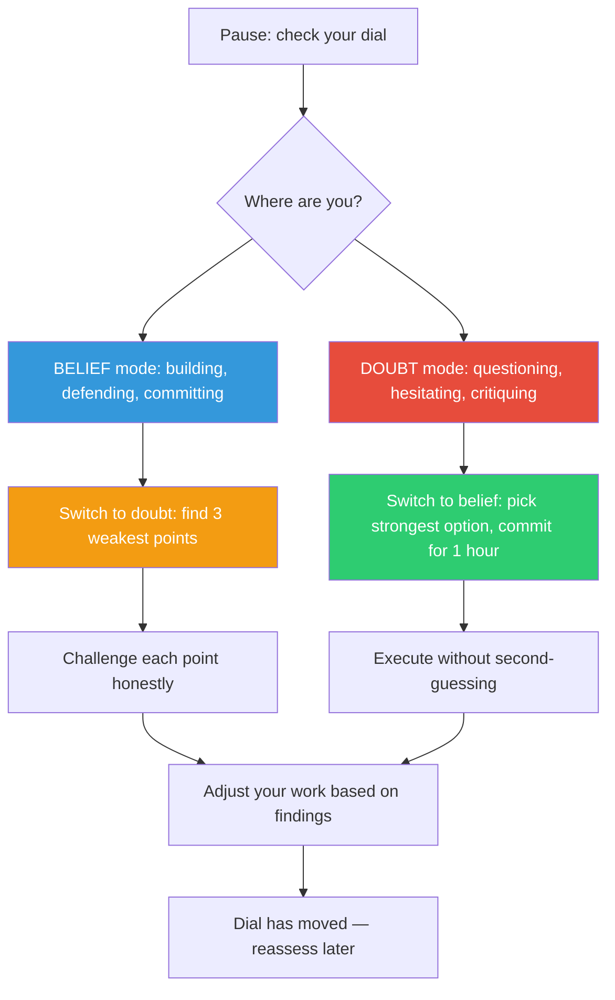

## The Move

Pause and assess your current cognitive stance. Ask: am I in BELIEF mode or DOUBT mode right now? Belief mode means building, executing, defending, committing, trusting your instincts. Doubt mode means questioning, challenging, stress-testing, hesitating, considering alternatives. Neither is wrong — but staying in either one for too long is dangerous.

If you have been in belief mode (building without questioning, defending without testing), switch to doubt mode: pick the three weakest points in your current work and challenge them honestly. If you have been in doubt mode (critiquing without building, hesitating without committing), switch to belief mode: pick the single strongest aspect of your best option and commit to it for the next hour. The dial should move through a session, not stay fixed.

## When to Use

- When you notice you have been in the same cognitive mode for more than an hour
- When the team is stuck in analysis paralysis (dial stuck on doubt)
- When you shipped something broken that obvious review would have caught (dial was stuck on belief)
- At natural transition points: before a review, after a planning session, midway through implementation

## Diagram

## Example

**Scenario — dial stuck on BELIEF:**

A developer has been building a custom event bus for three days. They chose it over Kafka because "we don't need Kafka's complexity." They have not benchmarked it, not reviewed alternatives, and when a teammate raised concerns, they said "trust me, it'll be fine."

**Dial check:** Pure belief mode. No doubt applied at all. Time to switch.

**Doubt mode applied:** Three weakest points: (1) No benchmark against Kafka — the "complexity" claim is untested. (2) No failure-mode analysis — what happens when the custom bus loses a message? (3) The custom bus has one author and zero tests — bus factor of one.

**Result:** Benchmarking revealed the custom bus handled 200 msg/sec vs. Kafka's 100K msg/sec. The "complexity" of Kafka was actually battle-tested reliability. They switched to Kafka in half a day.

---

**Scenario — dial stuck on DOUBT:**

A team has been evaluating databases for two weeks. They have a comparison spreadsheet with 47 criteria. Every option has flaws. Every meeting surfaces new concerns. No decision.

**Dial check:** Pure doubt mode. No belief applied at all. Time to switch.

**Belief mode applied:** Strongest option: PostgreSQL. It meets 80% of criteria, the team already knows it, and the 20% gap is in scenarios they will not hit for at least a year. Commit for one hour: start the schema design in PostgreSQL.

**Result:** After one hour of actual building, the theoretical concerns evaporated. Two of the "gaps" turned out to be non-issues in practice, and one was solvable with a simple extension. The team shipped the following week.

## Watch Out For

- The dial metaphor is descriptive, not prescriptive. There is no "correct" setting — the correct behavior is MOVEMENT. Belief then doubt then belief is healthy. Belief-belief-belief or doubt-doubt-doubt is not
- Belief mode is not arrogance and doubt mode is not weakness. Both are cognitive tools. The problem is getting stuck in one
- Teams tend to get stuck in one mode collectively. A team of builders stays in belief mode. A team of reviewers stays in doubt mode. Someone needs to name the pattern and turn the dial
- Do not use this as an excuse to avoid necessary doubt. "Let's just ship it, we've been in doubt mode too long" is valid only if you actually have been doubting. If the team has been debating scope (which is planning, not doubting), the dial check does not apply
- The one-hour commitment in belief mode is a time-box, not a permanent decision. You will return to doubt mode after the hour. This makes the switch feel safe
