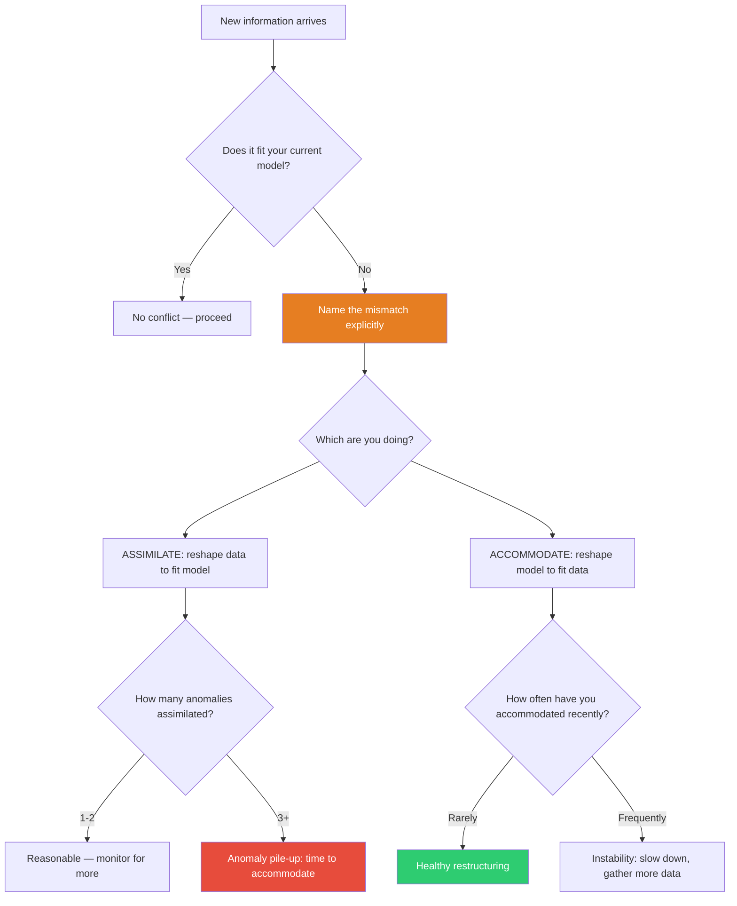

## The Move

Name the new information that doesn't fit your current mental model. Now name the two options: **ASSIMILATE** (interpret the new information so it fits your existing framework — "it's a special case," "the measurement is noisy," "it's an outlier") or **ACCOMMODATE** (restructure your framework to account for the new information — "my model is wrong, here's a new one"). State which one you are doing right now. If you've assimilated three or more anomalies in a row, you probably need to accommodate. If you've accommodated twice this week, you may be abandoning useful models too quickly.

## When to Use

- When new evidence contradicts your current design, architecture, or diagnosis
- When you notice yourself explaining away surprising results
- When your mental model has accumulated so many "except when..." clauses that it's no longer useful
- When you keep pivoting strategies and suspect you're overreacting to noise

## Diagram

## Example

**Situation:** You designed a caching layer to reduce database load. After deploying, response times actually got *worse* for 20% of requests.

**Assimilation attempt:** "It's probably cache misses during warm-up. Once the cache is hot it'll be fine." You wait a day. Still 20% slower. "Must be a specific query pattern — an edge case." You wait another day. Now 25% of requests are slower.

**Diagnosis:** You've assimilated two anomalies. The cache-warm-up excuse and the edge-case excuse both protect your original model ("caching makes things faster"). Time to accommodate.

**Accommodation:** You restructure your model. You profile the slow requests and discover the cache serialization overhead exceeds the database round-trip time for small, fast queries. Your new model: "Caching helps for expensive queries but hurts for cheap ones." This leads to a selective caching strategy — cache only queries above a latency threshold. The framework changed, not the data.

## Watch Out For

- Assimilation is not always wrong. Sometimes data really is noisy and your model really is correct. The signal is *accumulation* — one anomaly is data, three is a pattern.
- Accommodation is not always right. Rebuilding your entire mental model every time something surprises you produces chaos. Demand that the new model explain both the old successes and the new anomalies.
- The hardest case is when you're emotionally invested in the framework. You built the architecture, you chose the technology, you advocated for the approach. Investment makes assimilation feel like "defending good work" when it's actually "ignoring evidence."
- Teams can get stuck in collective assimilation — everyone agrees the framework is right because nobody wants to be the one to say it's wrong. Name the dynamic explicitly.
