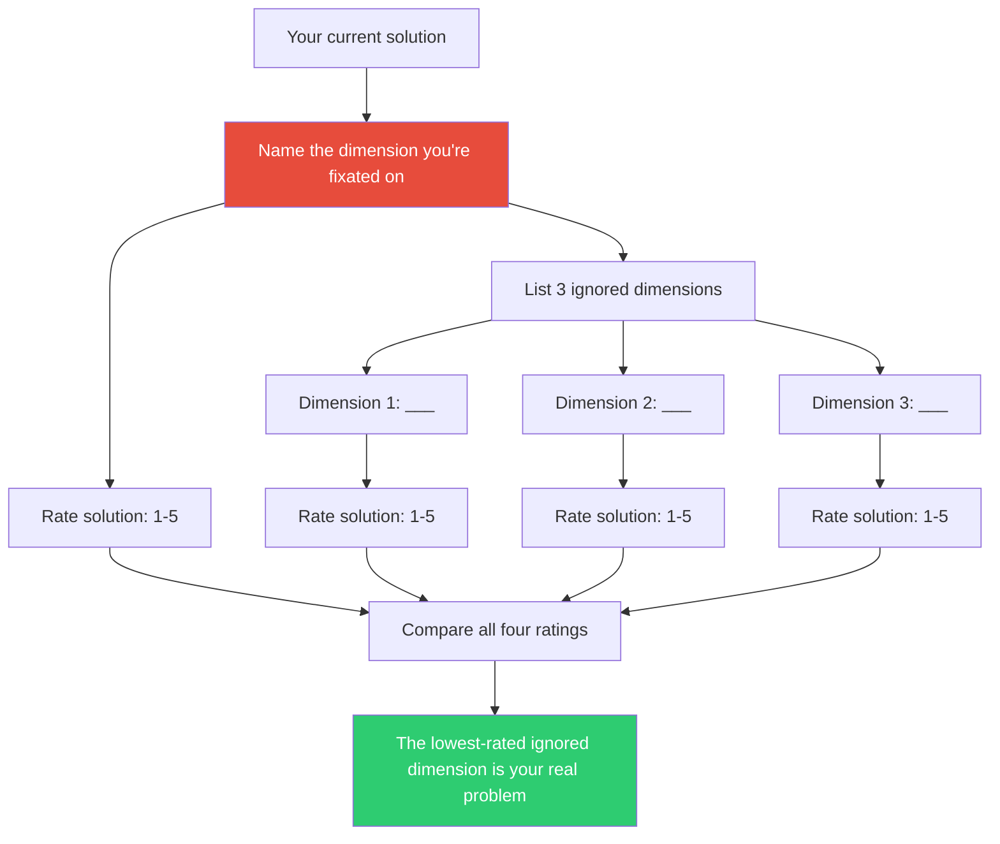

## The Move

Name the **single dimension** you've been evaluating your solution on. Write it down: "I've been focused on ___." (Performance? Cost? Simplicity? Time-to-ship? Elegance?) List {{count}} dimensions you're ignoring. Now list those dimensions that matter but that you haven't been weighing. Rate your current solution on all four dimensions, using a simple 1-5 scale. The dimension you weren't looking at is usually where the real problem lives.

## When to Use

- When you keep optimizing one metric and the solution still feels unsatisfying
- When a debate is stuck on a single axis (speed vs. cost, flexibility vs. simplicity)
- When you have a nagging feeling you're missing something but can't name what
- When evaluating options and every option looks roughly equivalent on your chosen metric

## Diagram

## Example

**Situation:** You're choosing between three database options for a new service. The team has spent two meetings debating query performance benchmarks.

**Fixated dimension:** Query speed.

**Three ignored dimensions:**
1. **Operational complexity** — who maintains it at 3 AM?
2. **Schema evolution** — how painful are migrations in year two?
3. **Team familiarity** — does anyone actually know this database?

**Rating the leading candidate (a fast but exotic graph database):**
- Query speed: 5/5
- Operational complexity: 2/5 (no one on the team has run it in production)
- Schema evolution: 1/5 (no migration tooling, manual graph surgery)
- Team familiarity: 1/5 (one person read the docs)

The graph database wins on the only dimension anyone was looking at and loses catastrophically on the three no one mentioned. The real problem was never query speed — it was operational sustainability.

## Watch Out For

- The fixated dimension is usually the one that's easiest to measure. Performance has benchmarks; maintainability doesn't. That's exactly why you fixate on it.
- Adding dimensions isn't an excuse to avoid decisions. Score them, weigh them, and pick. The goal is informed tradeoffs, not infinite criteria.
- Watch for "decoy dimensions" — adding a dimension just to justify the option you already prefer. Each dimension should matter independently of which option it favors.
- Piaget showed children can eventually hold multiple dimensions simultaneously. Adults can too, but only when they name the dimensions explicitly. If it's not written down, you're probably still centrating.
