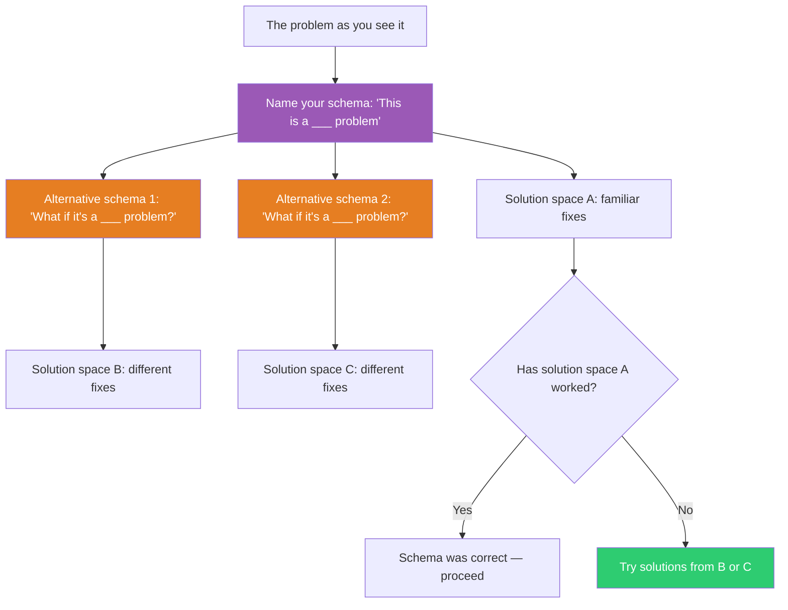

## The Move

Write down the category you've placed this problem in: "This is a ___ problem." (Performance problem. UX problem. People problem. Architecture problem. Data problem.) That category is your **schema** — it determines which solutions you search for. Now name **two alternative categories** this problem could belong to. For each alternative, ask: "If this were a {{domain.1}} problem, what would I try? If it were a {{domain.2}} problem?" Each schema opens a completely different solution space. If your current category hasn't produced a solution, the category — not the problem — may be wrong.

## When to Use

- When your first diagnosis felt instant and obvious — that's a schema firing automatically
- When all your proposed solutions have the same character (all technical, all process, all people-related)
- When someone else sees the same situation and reaches a completely different conclusion
- When the "obvious" fix hasn't worked and you're doubling down on the same approach

## Diagram

## Example

**Situation:** Your web app's checkout page has a 68% abandonment rate. The team has spent three sprints optimizing page load time, reducing it from 3.2s to 1.1s. Abandonment rate: still 68%.

**Current schema:** "This is a performance problem."
- Solutions tried: CDN, image compression, code splitting, lazy loading.
- Result: Page is fast. Users still leave.

**Alternative schema 1:** "This is a trust problem."
- New solutions: Add security badges, show return policy prominently, display customer reviews near the payment form, show a phone number.

**Alternative schema 2:** "This is a pricing problem."
- New solutions: Show total cost earlier (users see shipping cost for the first time at checkout and bail), offer price-match guarantee, add a discount code field that doesn't feel like a trap.

You add the total-cost preview on the product page. Abandonment drops to 41%. It was never a performance problem. The schema — "users leave because the page is slow" — was wrong. The real category was "users leave because of price surprise." Three sprints of optimization were wasted solving a correctly-diagnosed problem in the wrong category.

## Watch Out For

- The first schema that fires is usually based on your expertise. Engineers see technical problems. Designers see design problems. Managers see process problems. Your schema says more about you than about the problem.
- Alternative schemas should be genuinely different categories, not subcategories. "It's a frontend performance problem" to "it's a backend performance problem" is not a schema shift — both live inside the performance schema.
- You don't need to abandon your original schema — just test whether the alternatives explain the symptoms better. The schema that explains the most symptoms with the fewest exceptions wins.
- Beware of schema entrenchment: the more time and effort you've invested in solutions from one schema, the harder it is to consider alternatives. Sunk cost protects bad categories.
