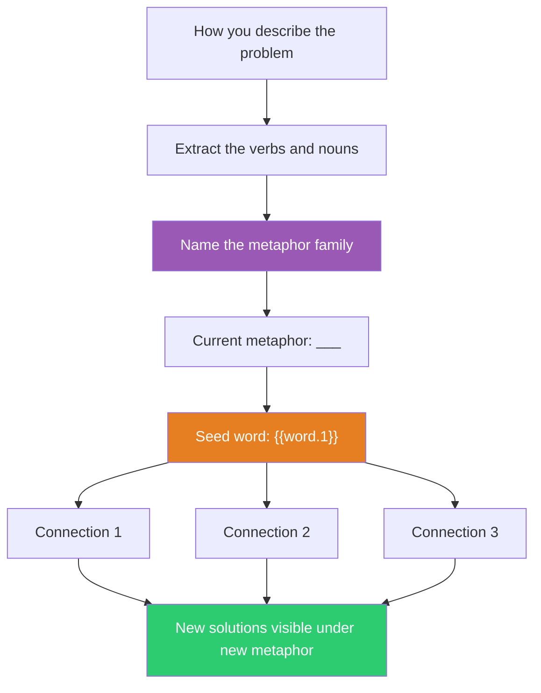

## The Move

Look at how you've been describing the problem. Find the verbs and nouns: "We need to **build** a solid **foundation**" (construction), "We need to **attack** the **root cause**" (war), "We need to **navigate** the **complexity**" (journey), "We need to **heal** this **broken** process" (medicine). Name the metaphor family. Write it down: "I've been thinking about this as ___."

Now replace it. Use the word **{{word.1}}** as a seed. Ask: "What if this problem were about **{{word.1}}**?" Generate three connections between {{word.1}} and your problem. The new metaphor makes different solutions visible — construction metaphors suggest foundations and scaffolding, gardening metaphors suggest pruning and seasons, water metaphors suggest flow and pressure.

## When to Use

- When you notice the same verbs recurring in your descriptions of the problem
- When proposed solutions all share a character you can't explain (all aggressive, all cautious, all structural)
- When you're stuck and suspect the framing is the cage, not the problem itself
- When switching between team members produces dramatically different descriptions of the same issue

## Diagram

## Example

**Problem:** "Our microservices architecture is fragile. We need to fortify the boundaries, build defensive walls between services, and armor the API contracts."

**Current metaphor:** War / Fortification. Solutions generated: stricter contracts, more validation, heavier authentication, defensive coding. Everything is about walls and armor.

**Seed word:** *river*

**Connections:**
1. Rivers have tributaries that merge — what if services were designed to merge data streams rather than guard borders? Event streaming instead of request/response.
2. Rivers find the path of least resistance — what if instead of fortifying every boundary, we let traffic flow to healthy services and route around failures? Circuit breakers and adaptive routing.
3. Rivers have floodplains — designed overflow areas. What if we built "floodplain" services that absorb overflow traffic gracefully instead of failing? Bulkhead pattern with degraded-mode services.

The war metaphor produced walls. The river metaphor produced flow, routing, and graceful overflow. The circuit breaker idea (connection 2) was invisible under the fortification frame but obvious under the river frame.

## Watch Out For

- You're not looking for a "better" metaphor. You're looking for a *different* one that opens different inferences. Every metaphor hides something.
- The exercise can feel silly. That's fine — the value is in the new inferences, not the poetry. Extract the concrete solution ideas and drop the metaphor.
- Watch for dead metaphors — language so conventional you don't notice it's metaphorical. "Debugging" (removing insects), "bottleneck" (narrow neck of a bottle), "pipeline" (water pipe). These are all metaphors structuring your thinking invisibly.
- Don't mix metaphors in your solution description. Pick the metaphor that produces the best concrete ideas, then describe the solution in plain terms.
