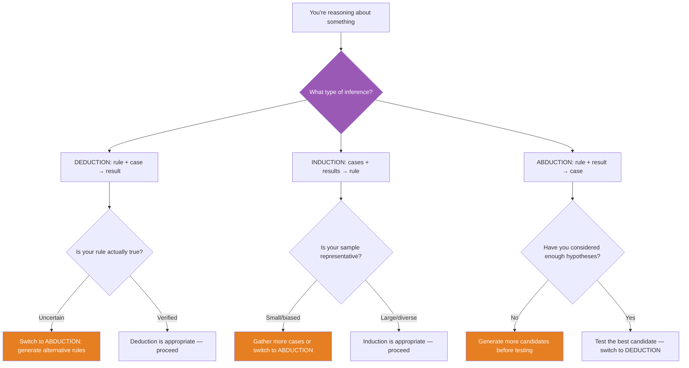

## The Move

Three inference types, each with a different shape:

- **DEDUCTION** — rule + case → result. "All services behind this load balancer return 503 when the config is stale. This service is behind that load balancer. Therefore it will return 503." Certain, but only as good as your rule.
- **INDUCTION** — cases + results → rule. "These {{number}} services all returned 503 after a deploy. Services probably return 503 after deploys." Probable, but only as good as your sample.
- **ABDUCTION** — rule + result → case. "Services return 503 when the config is stale. This service is returning 503. Therefore the config is probably stale." Explanatory, but only as good as your candidate hypotheses.

Name which one you're doing **right now**. Write it down. Then ask: is this the right inference type for where you are? If you're deducing from rules that might be wrong, switch to abduction and generate alternative explanations. If you're inducing from {{number}} cases, ask whether your sample is representative. If you're abducing, ask whether you've considered enough candidate explanations.

## When to Use

- When your reasoning feels sound but leads nowhere productive
- When you're stuck in a loop and can't tell why
- When you want to check the *structure* of your reasoning, not just its content
- When debugging and your current approach isn't converging on the root cause

## Diagram

## Example

**Situation:** Production is down. A developer is debugging.

**Phase 1 — Stuck in deduction:** "Our runbook says 503 errors mean the database is down. We're getting 503 errors. Therefore the database is down." They check the database — it's healthy. They check again. Still healthy. They're stuck because they're deducing from a rule that's incomplete. The runbook doesn't cover all causes of 503s.

**Diagnosis:** They're deducing, but the rule is wrong. Switch to **abduction**.

**Phase 2 — Abduction:** "We're getting 503 errors. What could cause 503 errors?" They generate candidates: database down (already eliminated), config stale, upstream dependency failing, memory exhaustion, certificate expired. They check each. The certificate expired 20 minutes ago. Abduction found the cause that deduction from an incomplete rule could not.

**Phase 3 — Induction for prevention:** "This is the third certificate expiry incident in 6 months. Certificate expiries probably recur on a regular basis." Induction from 3 cases → new rule. They set up automated certificate rotation.

**Phase 4 — Deduction for verification:** "Automated rotation renews certificates 30 days before expiry. This certificate expires in 45 days. Therefore it will be renewed in 15 days." Deduction from the new rule confirms the fix.

Four phases, three inference types, each appropriate to its moment. The developer got stuck in Phase 1 because they were deducing from a bad rule instead of abducing from the symptoms.

## Watch Out For

- Most people default to deduction because it feels rigorous. But deduction from a wrong rule is worse than abduction from good observations. Name the type to catch this.
- Induction is dangerously seductive with small samples. "It worked on my machine" (n=1) is induction. "It worked in staging" (n=1, different environment) is induction from a non-representative sample. Name it.
- Abduction is the most creative inference type but also the most error-prone. It generates hypotheses, not truths. Always follow abduction with a test.
- In practice, good reasoning cycles through all three types: abduce to generate hypotheses, deduce predictions from each, induce patterns from the test results. The stuck feeling usually means you're stuck in one type when you need to switch.
