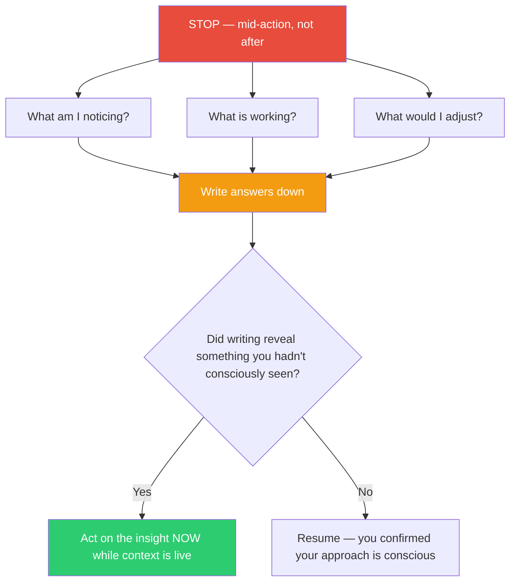

## The Move

Checkpoint: stop what you are doing right now — not after this function, not after this paragraph, now. Answer three questions in writing: "What am I noticing?" (observations about the work as it unfolds), "What is working?" (what is producing results or moving toward the goal), and "What would I adjust?" (what your in-process experience is telling you to change). Schon's key distinction: reflection-ON-action happens after the fact and misses the signals of the moment; reflection-IN-action happens mid-process while context is still loaded and captures signals that vanish once you step away. Write the answers down — do not just hold them in memory. The act of writing forces the implicit to become explicit.

## When to Use

- You have been coding, writing, or designing for more than 20 minutes without a conscious check-in
- Something feels subtly wrong but you cannot name it
- You are about to commit, ship, or hand off work and want to capture what you learned mid-process
- You notice yourself making repeated micro-corrections in the same area

## Diagram

## Example

**Situation:** You are 40 minutes into refactoring an authentication service. You have extracted a token-validation helper, renamed some variables, and are now rewriting the session-refresh logic.

**The pause:**
- **What am I noticing?** Every function I touch has a hidden dependency on a global config object. I keep working around it instead of addressing it.
- **What is working?** The token-validation extraction was clean — tests still pass, the interface is simpler.
- **What would I adjust?** I should stop refactoring individual functions and instead inject the config explicitly. The global config is the real problem, not the function signatures.

**Result:** Without the pause, you would have finished the refactor, filed a PR, and only realized during review that the config coupling is the root issue. The mid-action pause caught it while the context was still loaded. You pivot to dependency injection now, saving a second pass.

## Watch Out For

- Do not turn this into a lengthy journaling exercise. Three sentences total is fine. The value is in the interrupt, not the prose
- Reflection-in-action is not the same as second-guessing. You are observing, not doubting. If every pause leads to abandoning your approach, you are over-correcting
- This move is most valuable when things feel fine — the "everything is going smoothly" moments are exactly when tacit knowledge is doing the most work and is least visible
- If you cannot answer "what am I noticing?" you may have been operating on pure autopilot. That itself is the finding
