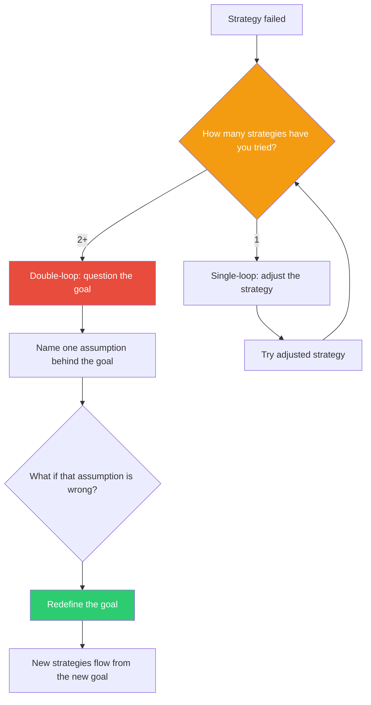

## The Move

Ask two questions in sequence. First, single-loop: "Am I doing this right?" — is my execution of the current strategy effective? Second, double-loop: "Am I doing the right thing?" — are my goals, assumptions, or success criteria themselves correct? If you have already tried multiple strategies and all have failed, the problem is probably not execution. The problem is one level up: the goal, the framing, or the constraints you accepted without question. Name one assumption behind your current goal and ask: "What if this assumption is wrong? What would I be doing instead?"

## When to Use

- You have tried multiple approaches to the same problem and none have worked
- You are hitting the same category of obstacle repeatedly despite changing tactics
- A delivered solution technically meets requirements but feels wrong or unsatisfying
- You are optimizing a metric but outcomes are not improving

## Diagram

## Example

**Situation:** Your team is trying to reduce API response time. You have tried caching, query optimization, and moving to a faster serialization format. Each helped marginally, but the p95 latency is still above the 200ms target.

**Single-loop (what you have been doing):** "How else can we make this endpoint faster?" More optimization tactics — connection pooling, read replicas, CDN.

**Double-loop (the check):** "Why is the target 200ms?" You trace it back: a product manager set 200ms because "fast feels instant." But the endpoint serves a background data sync that users never directly wait for. The actual user-facing interaction is a different endpoint entirely — and that one is already at 50ms.

**Result:** You were optimizing the right thing (execution was fine) for the wrong goal (the latency target was misapplied). Double-loop: change the target to 2 seconds for the background sync, redirect the performance effort to the user-facing endpoints that actually matter. Three weeks of optimization work were wasted because nobody questioned the goal.

## Watch Out For

- Double-loop thinking is not an excuse to abandon every plan at the first sign of difficulty. Try single-loop first — sometimes the strategy just needs adjustment
- Questioning goals can feel threatening in team settings. Frame it as learning, not blame: "What did we assume that might not hold?" not "Who set this bad goal?"
- It is possible to get stuck in an infinite loop of questioning goals. At some point you must commit to a goal and execute. Double-loop is a check, not a lifestyle
- The most dangerous single-loop traps are the ones where each iteration shows just enough improvement to keep you going. Small gains can mask a fundamentally wrong direction
