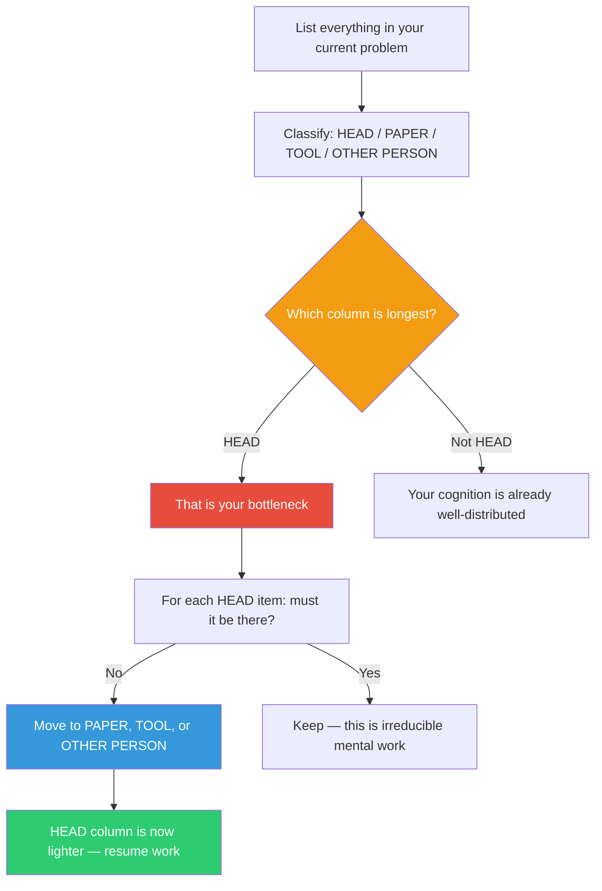

## The Move

Draw four columns: HEAD, PAPER, TOOL, OTHER PERSON. For your current problem, list every piece of information, decision, or constraint and place it in the column where it currently lives. Now look at the HEAD column. The longest column is your bottleneck. For each item in HEAD, ask: "Does this NEED to be in my head, or am I just keeping it there out of habit?" Move at least three items out of HEAD into one of the other columns — write it on a sticky note (PAPER), encode it in a test or config file (TOOL), or tell a teammate and make it their responsibility (OTHER PERSON). Hutchins showed that a ship's navigation team is smarter than any individual because the computation is distributed across people and instruments. Your "team" includes your notes, your IDE, and your colleagues.

## When to Use

- You feel overwhelmed and cannot explain why the problem is so hard
- You keep re-deriving the same facts because you forgot a detail
- You are the single point of failure for understanding a system
- You are about to context-switch and need to preserve your mental state

## Diagram

## Example

**Situation:** You are debugging a distributed system issue where requests intermittently fail between Service A and Service B. You feel stuck and overwhelmed.

**The audit:**
| HEAD | PAPER | TOOL | OTHER PERSON |
|------|-------|------|--------------|
| Service A's retry logic (3 retries, exponential backoff) | | | |
| The fact that Service B recently changed its timeout from 30s to 10s | | | |
| Three different error messages you saw in the logs | | | |
| The network team's statement that latency is normal | | | |
| Your hypothesis that connection pooling is exhausted | | | |
| The deployment timeline of the last 4 releases | | | |

Everything is in HEAD. No wonder you are stuck.

**Offloading:**
- Move error messages to PAPER: write them on a sticky note so you stop re-checking the logs.
- Move deployment timeline to TOOL: write a script that pulls deploy timestamps and correlates them with error spikes.
- Move the timeout change to OTHER PERSON: ask the Service B team to confirm the change and its rationale.
- Move retry logic to TOOL: write it as a comment in your debugging doc so you stop recalculating backoff windows.

**Result:** HEAD now contains only your hypothesis and the network team's claim — the two things that actually require your judgment. Everything else is externalized. The problem went from overwhelming to tractable.

## Watch Out For

- Offloading is not the same as delegating. Putting something on paper still means you own it — you have just freed up working memory
- Some things genuinely must stay in your head: creative connections, judgment calls, the "feel" of a problem. Do not try to externalize everything
- If you offload to OTHER PERSON, make sure they know they are holding that piece. Implicit distribution is not distribution — it is dropping
- Revisit the audit if the problem changes shape. What you externalized may need to come back into HEAD, and what was in HEAD may become irrelevant
