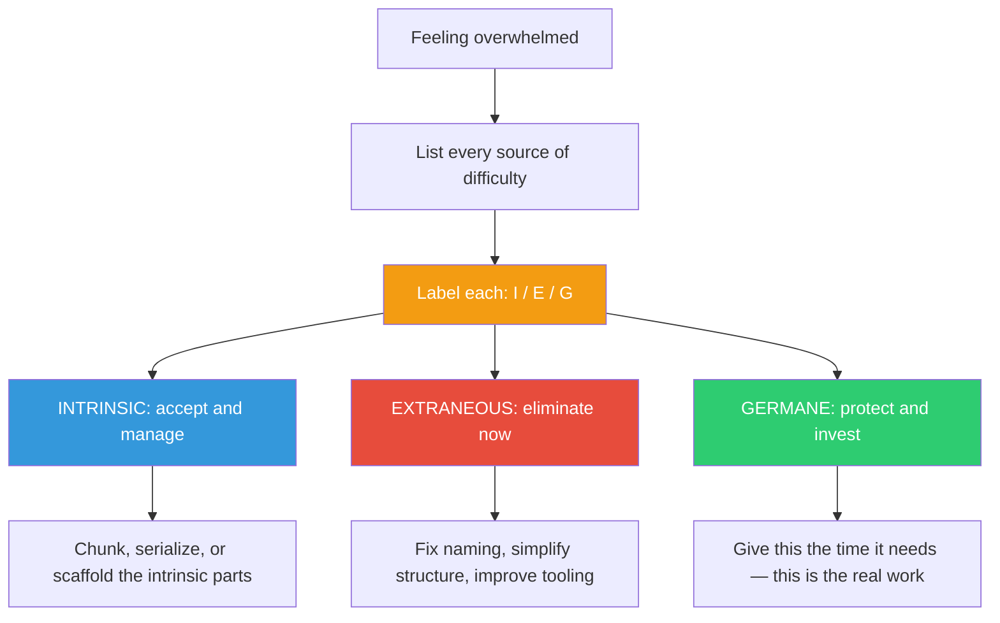

## The Move

When you feel overwhelmed, classify the load you are carrying into three buckets. INTRINSIC: load that comes from the problem itself being genuinely complex — many interacting elements, unavoidable dependencies. You cannot reduce this; you can only manage it. EXTRANEOUS: load that comes from how you or your environment have organized the problem — confusing naming, scattered documentation, unnecessary abstraction layers, poor tooling. This load is waste. Eliminate it. GERMANE: load from the productive work of building understanding — forming mental models, making connections, integrating new knowledge. This load is valuable. Protect it. For each source of difficulty you are experiencing right now, label it I, E, or G. Then act: accept I, eliminate E, protect G.

## When to Use

- You feel overwhelmed but cannot articulate what is making the work hard
- You suspect the problem is not as complex as it feels
- Your tooling, documentation, or project structure is adding friction
- You are struggling to learn something new and want to separate learning difficulty from problem difficulty

## Diagram

## Example

**Situation:** You are integrating a third-party payment processor. The work feels impossibly hard. You are stressed, context-switching constantly, and making little progress.

**Load triage:**
- **INTRINSIC:** Payment processing genuinely involves complex state machines (pending, authorized, captured, refunded, disputed). Multiple currencies add combinatorial complexity. PCI compliance has real constraints. This is hard because payments are hard. *Accept it.*
- **EXTRANEOUS:** The vendor's documentation is split across three different sites. Their SDK uses different naming conventions than their API docs. Your team's existing payment code mixes business logic with HTTP calls. You keep five browser tabs open just to cross-reference. *This is waste — consolidate the docs into one local reference, rename SDK calls to match docs, refactor the existing code to separate concerns BEFORE integrating.*
- **GERMANE:** You are learning idempotency patterns for the first time and building a mental model of how webhooks handle async state transitions. This is slow but valuable. *Protect this time — do not shortcut it by copy-pasting Stack Overflow patterns you do not understand.*

**Result:** The payment integration is still hard (intrinsic), but after cleaning up the extraneous load (30 minutes of prep), the remaining work is tractable. The learning (germane) is an investment that pays off for every future integration.

## Watch Out For

- The most insidious extraneous load is the kind you have lived with so long you think it is intrinsic. Question every "that's just how it is" source of difficulty
- Do not eliminate germane load in pursuit of speed. Skipping the understanding-building phase saves time now and costs it later, with interest
- Intrinsic load is not fixed forever — it is fixed for your current skill level. What is intrinsic today may become automatic after practice. But right now, you must deal with it as-is
- If everything lands in the INTRINSIC column, you may be accepting unnecessary complexity. Get a second opinion — ask someone to classify your list independently
