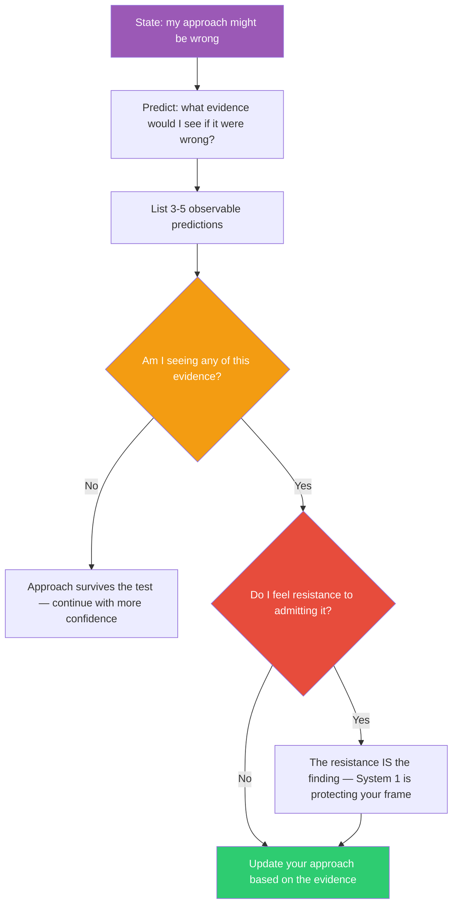

## The Move

The core System 2 operation is DECOUPLING: representing a hypothetical situation in your mind without letting your beliefs, preferences, or identity contaminate it. Try this now. Say: "Purely hypothetically, my current approach is completely wrong." Do not flinch — you are not admitting it IS wrong. Now ask: "If it were wrong, what evidence would I expect to see in the world?" Write down 3-5 observable predictions. Now check: "Am I seeing any of this evidence?" If the answer is yes and you feel resistance to admitting it, that resistance is the finding. Your System 1 is protecting your current frame. Alternatively, ask {{persona.1}}: "What would they see that I am blind to?" Stanovich showed that intelligence is not enough for rationality — you also need the DISPOSITION to decouple from your own perspective.

## When to Use

- You feel certain about your approach but have not tested that certainty
- Someone disagrees with you and your first reaction is defensive
- You have been building on the same assumption for a long time without re-examining it
- Confirmation bias is a known risk in your current situation

## Diagram

## Example

**Situation:** You have spent two weeks building a microservices architecture for a new product. You chose microservices because "we need to scale independently" and "monoliths are hard to maintain." A junior engineer asked: "Why not a monolith?" You felt a flash of irritation.

**Cognitive decoupling:**
"Purely hypothetically, microservices is the wrong choice for this project."

**If it were wrong, what evidence would I expect?**
1. The services would have high coupling — frequent cross-service calls for single user operations.
2. Development velocity would be slower than expected due to infrastructure overhead.
3. The team would spend more time on service mesh, deployment pipelines, and distributed debugging than on product features.
4. The "independent scaling" benefit would be unused because we do not yet know which service needs to scale.

**Reality check:**
1. Yes — three of our five endpoints require data from two or more services.
2. Yes — we spent last week setting up service discovery and distributed tracing.
3. Yes — the infrastructure-to-feature ratio is about 70/30.
4. Yes — we have 12 users in beta. Nothing needs to scale.

**Result:** All four predictions match reality. The resistance you felt when the junior engineer asked was System 1 defending your ego investment ("I chose this, so it must be right"). The decoupled analysis reveals that a modular monolith would have delivered more product value in the same two weeks. The architecture is not wrong forever — but it is wrong for right now.

## Watch Out For

- Decoupling is a skill, not a switch. If you truly cannot imagine being wrong, start with smaller stakes — practice on decisions you care less about
- This move can induce decision paralysis if overused. Not every decision needs a decoupling audit. Reserve it for high-stakes or high-attachment situations
- The emotional resistance signal is only useful if you are honest with yourself. If you perform the exercise and conclude "no resistance, I'm totally open-minded" too quickly, you may not be decoupling — you may be performing decoupling
- Having evidence that your approach might be wrong does not mean you must abandon it. It means you must weigh that evidence honestly instead of dismissing it
