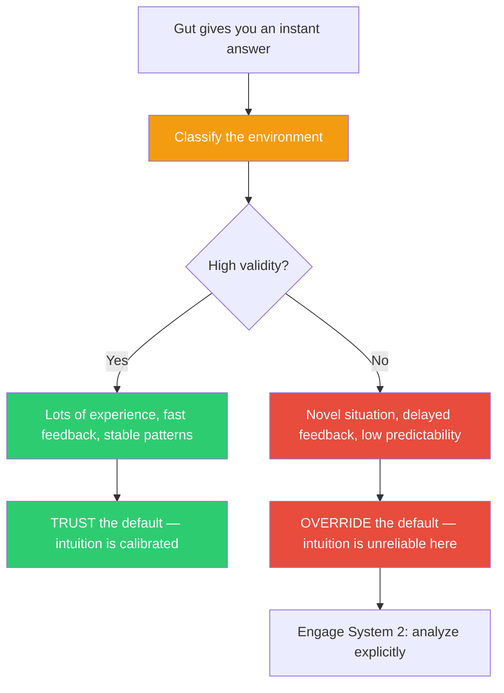

## The Move

Your System 1 just gave you a default answer — an instinctive response, a gut feeling, an immediate preference. Before accepting or overriding it, classify the environment you are in. HIGH-VALIDITY: you have extensive personal experience in this domain, feedback on past decisions was fast and clear, the situation has stable regularities. Examples: debugging a familiar codebase, reviewing code in your primary language, estimating tasks you have done before. In high-validity environments, trust the default — your intuition has been well-calibrated by experience. LOW-VALIDITY: the situation is novel, feedback is delayed or absent, the domain has low predictability. Examples: predicting user behavior for a new feature, estimating a project unlike any you have done, choosing technology for a use case you have not tested. In low-validity environments, override the default — your intuition is pattern-matching against the wrong patterns. Name which environment you are in. Then act accordingly.

## When to Use

- You have a strong instinctive answer and want to know whether to trust it
- You are deciding between "go with your gut" and "analyze more carefully"
- Someone experienced disagrees with someone analytical and both seem reasonable
- You are in a new role, new domain, or new problem space and your instincts feel suspiciously confident

## Diagram

## Example

**Situation 1 — High validity:** A pull request comes in that refactors the authentication middleware you wrote and have maintained for two years. Your gut says: "This changes the token validation order and will break refresh tokens." You have seen this exact category of bug before, you get fast feedback (tests catch it), and the patterns in this code are deeply familiar. **Trust the default.** Post the review comment. Do not second-guess yourself into a two-hour analysis.

**Situation 2 — Low validity:** The team is choosing between GraphQL and REST for a new public API. Your gut says: "GraphQL, obviously — it's more flexible." But you have never built a public GraphQL API, you have no data on how your specific clients will use it, and the feedback loop (adoption, developer experience complaints) is months long. **Override the default.** Your gut is pattern-matching against blog posts and conference talks, not against your own calibrated experience. Do the analysis: prototype both, talk to potential consumers, estimate maintenance burden.

**The key distinction:** In Situation 1, your intuition is earned. In Situation 2, your intuition is borrowed. Earned intuition is trustworthy. Borrowed intuition is not.

## Watch Out For

- The hardest case is when you THINK you are in a high-validity environment but are not. Domain expertise does not transfer automatically — being an expert at backend systems does not make your gut reliable for frontend UX decisions
- Trusting intuition in high-validity environments does not mean being unable to explain it. You should be able to articulate WHY your gut says what it says, even if you arrived at the answer before the explanation
- In genuinely high-validity environments, over-analysis can be worse than trusting the default. Analysis paralysis is a real cost. Do not penalize good intuition by demanding justification for every call
- The validity of an environment can change. A codebase you knew deeply a year ago may have drifted. Re-assess periodically
