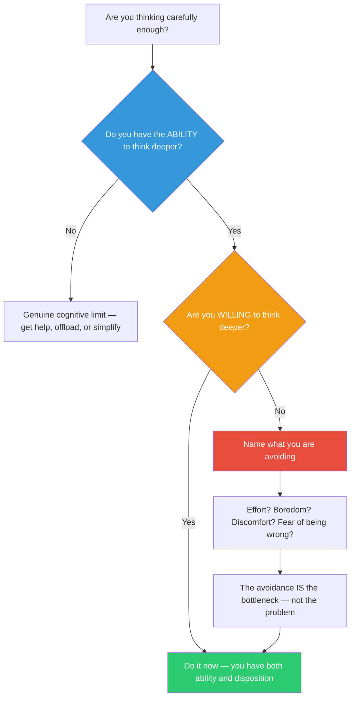

## The Move

Stanovich split System 2 into two parts. The ALGORITHMIC mind: your raw processing power — can you analyze this problem? The REFLECTIVE mind: your disposition to question and engage — will you bother? Most everyday thinking failures are not failures of ability. They are failures of disposition. You have the cognitive horsepower to think deeper about this problem. The question is whether you are choosing to deploy it. Ask yourself right now: "Do I have the ability to think more carefully about this? Yes. Am I choosing to?" If the answer is "I could but I won't," you have found the real bottleneck. It is not complexity. It is not information. It is willingness. Name what you are avoiding: is it effort, boredom, discomfort, the risk of discovering you are wrong? Consider: {{koan.1}}.

## When to Use

- You catch yourself settling for a "good enough" answer on something that matters
- You are taking mental shortcuts and you know it
- Someone asks you to think harder and you feel irritation rather than curiosity
- The problem requires careful analysis but you keep reaching for quick heuristics
- You have been wrong in this category before and you are about to make the same kind of snap judgment

## Diagram

## Example

**Situation:** Your team needs to decide on a database migration strategy. There are three options: big-bang migration over a weekend, gradual dual-write migration, or strangler-fig pattern with a compatibility layer. You sit in the planning meeting and think: "Dual-write, obviously. Let's go."

**The check:**
- **Do you have the ability to analyze this more carefully?** Yes. You could model the failure modes of each option, estimate the timeline and risk, and check whether dual-write introduces consistency bugs.
- **Are you willing to?** Honestly, no. The meeting has been going on for an hour. You want it to be over. Dual-write "sounds right" and you do not want to invest the mental energy to find out if it is actually right.

**What are you avoiding?** Effort and the discomfort of discovering that the analysis might favor the harder option (strangler-fig), which would mean more work for you.

**Result:** You recognize the bottleneck is disposition, not complexity. You ask for 30 minutes to sketch the failure modes of each option. The analysis reveals that dual-write has a subtle data consistency risk during the transition window that your gut did not account for. The strangler-fig pattern avoids it. The extra 30 minutes of willingness saves a potential production incident.

## Watch Out For

- This move is not a guilt trip. Sometimes choosing NOT to think deeper is the right call — not every decision deserves deep analysis. The point is to make that a conscious choice, not an unconscious default
- Be honest about the difference between "I've thought enough" and "I don't want to think more." The former is a judgment; the latter is avoidance
- Stanovich's insight applies to teams, not just individuals. A team of smart people can collectively choose not to think hard — especially when consensus forms early and nobody wants to be the person who slows things down
- The most dangerous form of unwillingness is the one disguised as confidence: "I'm sure about this" can mean "I know this" or "I don't want to check"
