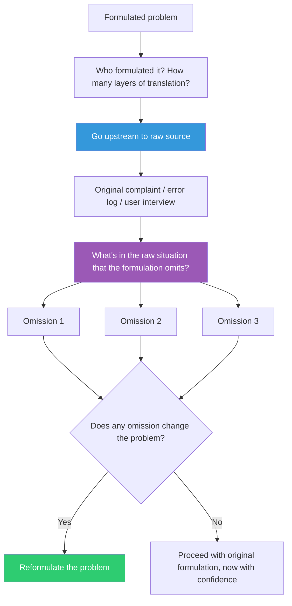

## The Move

Identify who formulated the problem you're working on and how many layers of translation it passed through. Then go upstream: read the original user complaint, the raw support ticket, the unedited customer interview, the actual error log. Not the summary. Not the Jira ticket. Not the product spec that summarized the spec that summarized the interview. Ask: "What would {{persona.1}} see in the raw situation that the formulation left out?" Write down at least three things present in the raw situation that are absent from your current problem formulation. Any of those omissions might be the key.

## When to Use

- You're solving a problem defined by someone else and it doesn't feel right
- The requirements have been translated through multiple layers (user to PM to designer to ticket)
- Every solution you attempt fights the constraints of the problem statement
- The problem was formulated long ago and the context has since changed

## Diagram

## Example

**Situation:** A ticket says "Users report the search feature is broken." The PM summarized this from a support thread. You've been debugging the search index for two days.

**Go upstream:** You read the original support thread. The user wrote: "I searched for 'invoice Q4 2025' and got nothing. But when I scrolled down manually I found it. It's called 'Q4-2025-invoice-final-v2.docx'."

**What the raw situation reveals that the formulation omits:**
1. The user searched for a semantic description, not a filename — search works by filename but the user expects it to work by content/meaning.
2. The user DID find the file manually — the file exists and is accessible, so this isn't a data or permissions problem.
3. The filename uses a different format than the search query — "Q4 2025" vs. "Q4-2025."

**Reformulation:** Search isn't "broken." It works exactly as designed — by filename matching. The real problem is that search doesn't match how users think about their files. The fix isn't a search index repair; it's adding semantic or fuzzy matching. Two days of index debugging were spent on the wrong problem because the formulation ("search is broken") compressed away the actual user behavior.

## Watch Out For

- Going upstream takes time and sometimes access you don't have. If you can't reach the raw source, at least identify what was probably lost in translation and flag it as a risk
- The raw situation is messy by definition. That's not a bug — it's the point. The messiness contains information that clean formulations discard
- This is not an excuse to ignore every problem statement and relitigate requirements from scratch. Use it when solutions keep fighting the problem definition — that's the signal that the formulation is lossy in a way that matters
- Sometimes the formulation is fine and the raw situation confirms it. That outcome is valuable too — you can now proceed with confidence instead of nagging doubt
