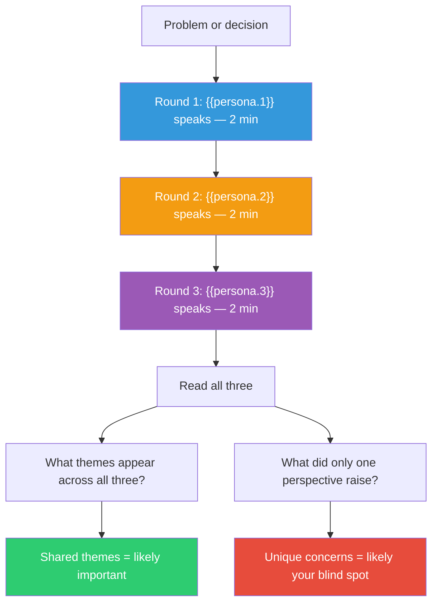

## The Move

Structure your thinking as a Micro Lab protocol with three rounds. **Round 1:** Write from the perspective of **{{persona.1}}**. Give them 2 minutes. What do they see? What matters to them? What are they worried about? Write without interrupting, qualifying, or rebutting from your own perspective. **Round 2:** Same for **{{persona.2}}**. The previous perspective is SILENT — you cannot respond to Round 1 yet. **Round 3:** Same for **{{persona.3}}**. All previous perspectives remain silent. **Synthesis:** Now read all three. What themes appear across all three? What did one perspective see that the others missed? Where do they agree? Where they agree is likely important. Where only one spoke up is likely your blind spot.

## When to Use

- You need to consider multiple stakeholder perspectives on a decision
- Your thinking keeps defaulting to one viewpoint
- A team discussion was dominated by one voice and you want to recover the missing perspectives
- You're making a decision that affects different groups differently

## Diagram

## Example

**Situation:** You're deciding whether to introduce a breaking API change that simplifies the codebase but requires all clients to migrate within 90 days.

**Round 1 — {{persona.1}} speaks:**
"I see a codebase that's accumulating complexity because we keep maintaining backward compatibility. Every new feature takes 30% longer because of the compatibility layer. The breaking change is a one-time cost that pays dividends for years. The 90-day window is generous. If clients can't migrate in 90 days, they have larger problems."

**Round 2 — {{persona.2}} speaks:**
"I see an API that 200 external clients depend on. A breaking change means 200 teams must schedule migration work — work that competes with their own priorities. Some of these clients are on legacy systems that make migration genuinely hard, not just inconvenient. The 90-day clock starts a countdown of escalating support tickets. Who handles those tickets? The team proposing the change. The productivity gain might be eaten by migration support."

**Round 3 — {{persona.3}} speaks:**
"I see a precedent being set. If we break the API now, clients learn that our APIs are unstable. Trust erodes. Future adoption of new APIs decreases because teams build defensive wrappers instead of direct integrations. The technical benefit is real but the organizational signal matters more. Can we get the simplification without the breaking change — even if it's harder?"

**Synthesis:**
- All three agree the complexity is real and costly.
- Round 2 surfaces the support cost that Round 1 ignored.
- Round 3 surfaces a reputational/trust dimension nobody mentioned.
- The blind spot was the precedent effect — how this decision changes future behavior, not just the current codebase.

**Result:** The team decides to ship the simplified API as a v2 alongside the existing v1, deprecating v1 with a 12-month sunset instead of a 90-day hard break. This preserves the simplification, avoids the trust damage, and spreads the migration support load.

## Watch Out For

- The hardest part is keeping the perspectives truly separate. When writing Round 2, you'll want to rebut Round 1. Don't. The enforced silence is the mechanism. If perspectives argue with each other during their turns, you're doing a debate, not a Micro Lab
- The personas are starting points. Let each perspective develop its own logic during its 2 minutes — don't puppet them into saying what you already think
- If all three perspectives agree on everything, your perspectives aren't diverse enough. Re-roll or manually choose a perspective you find uncomfortable
- This move is most powerful when at least one persona represents someone you're naturally unsympathetic to. That's where blind spots live
