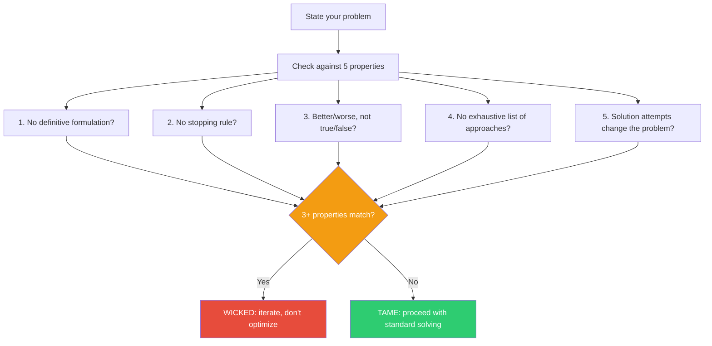

## The Move

Check your problem against Rittel's five core properties: (1) **No definitive formulation** — defining the problem IS the problem. (2) **No stopping rule** — you could always do more. (3) **Solutions aren't true/false**, just better/worse. (4) **No exhaustive list of approaches** — you can always think of another one. (5) **Every solution attempt changes the problem**. Count how many apply. If three or more match, STOP treating this as a tame problem with a clean solution. Switch from optimization to iterative engagement — the solution and the problem will co-evolve.

## When to Use

- You keep redefining the problem every time you discuss it
- The team disagrees about what "done" means and no definition sticks
- Previous solution attempts made things different but not clearly better
- You sense the problem is fundamentally different from your usual technical challenges

## Diagram

## Example

**Problem:** "How should we structure our platform's API so that both internal teams and external partners can use it effectively?"

**Property check:**

| # | Property | Applies? | Evidence |
|---|----------|----------|----------|
| 1 | No definitive formulation | Yes | Internal teams want speed and flexibility; partners want stability and documentation. Defining "effective" for one group contradicts the other. |
| 2 | No stopping rule | Yes | You could always add more endpoints, better docs, more versioning support. |
| 3 | Better/worse, not true/false | Yes | No objectively correct API design — only trade-offs between consistency, flexibility, and discoverability. |
| 4 | No exhaustive list of approaches | Yes | REST, GraphQL, gRPC, BFF pattern, API gateway, SDK-first — and someone will suggest another one tomorrow. |
| 5 | Solution attempts change the problem | Yes | Once you ship a public API, partners build on it. Now the problem includes backward compatibility, which didn't exist before. |

**Score: 5/5.** This is deeply wicked. Stop searching for the right API design. Instead: ship something small, learn from real usage, iterate. Accept that the API and the understanding of what partners need will co-evolve.

## Watch Out For

- Not every hard problem is wicked. A gnarly performance bug is hard but tame — it has a definitive formulation and a clear stopping rule. Don't use "wicked" as an excuse to avoid rigorous analysis on tame problems
- Wicked does not mean unsolvable. It means the approach must be iterative rather than plan-then-execute. You can make real progress — just not by optimizing a fixed target
- Teams sometimes declare a problem wicked to avoid accountability for solving it. If fewer than 3 properties match, the problem is probably tame and you should solve it directly
- The wickedness check itself can shift depending on scope. Zoom in enough and most wicked problems contain tame sub-problems you can solve right now
