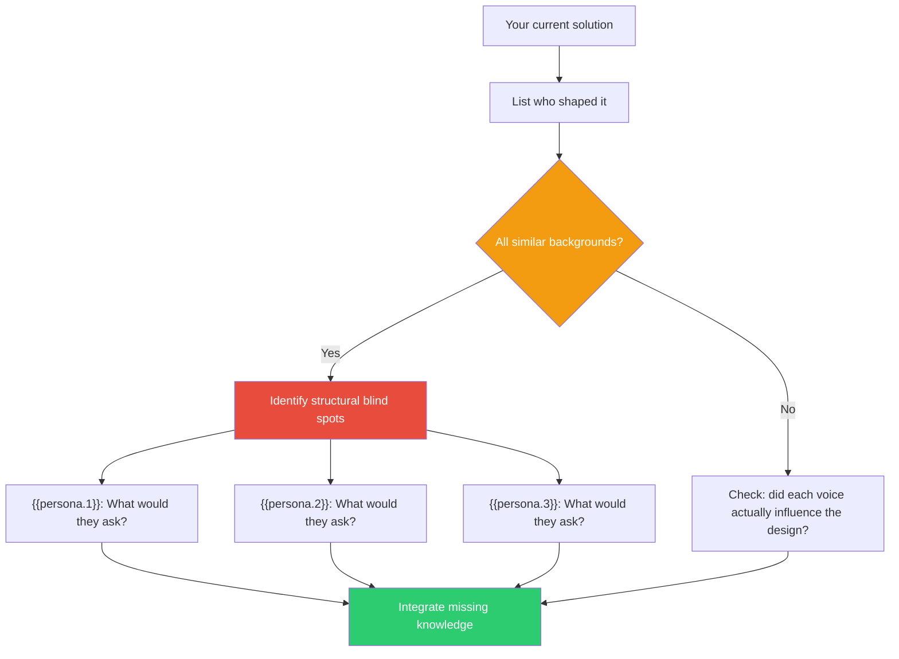

## The Move

In wicked problems, no single expert has sufficient knowledge — every stakeholder holds unique, relevant knowledge that others structurally cannot possess. This is Rittel's "symmetry of ignorance." Ask: "Whose perspective am I missing that is not merely different but NECESSARY?" Consider: **{{persona.1}}**, **{{persona.2}}**, **{{persona.3}}** — which of them sees something about this problem that you structurally cannot? Identify one concrete question each would ask that nobody in your current group has asked. This is not politeness or inclusivity theater — it is an epistemic requirement.

## When to Use

- You are designing something that will affect people unlike yourself
- The decision-making group is homogeneous in background or role
- A solution feels suspiciously complete and unopposed
- You are about to commit resources based on a single perspective

## Diagram

## Example

**Problem:** A backend team is designing a new error-handling strategy for their API. They have agreed on structured error codes, retry headers, and a circuit-breaker pattern. The design feels solid.

**Missing knowledge check:**

- **{{persona.1}} (e.g., a mobile developer):** "What happens on a flaky 3G connection when the retry header says 'try again in 5 seconds' but the user has already navigated away? Does the retry queue persist across app restarts?" The backend team never considered offline-first scenarios.
- **{{persona.2}} (e.g., a support engineer):** "When a customer calls about error code E-4012, can I look that up anywhere? Is there a human-readable mapping? Right now our support team googles our own error codes." The team designed for machines, not the humans who debug in production.
- **{{persona.3}} (e.g., a third-party integrator):** "Your error response says 'invalid request' but doesn't tell me WHICH field is invalid. I'll file 30 support tickets before I figure out it's a date format issue." The team assumed callers understand the schema as well as they do.

**Result:** Three blind spots surfaced — offline resilience, support tooling, and developer experience for external consumers. None of these are visible from inside the backend team's expertise. The person you would least think to consult (support engineer) held the most operationally critical insight.

## Watch Out For

- Do not confuse "consulting stakeholders" with "getting sign-off." The point is to learn something you do not know, not to get approval for something you already decided
- The most valuable missing perspective is often the one that feels irrelevant. If you think "why would we ask THEM?" — that is exactly the person to ask
- Three perspectives is a starting point, not a ceiling. But three genuine consultations beats ten perfunctory ones
- Beware of tokenism — asking someone for their perspective and then ignoring it because it complicates your plan. If the input does not change anything, you did not actually incorporate it
