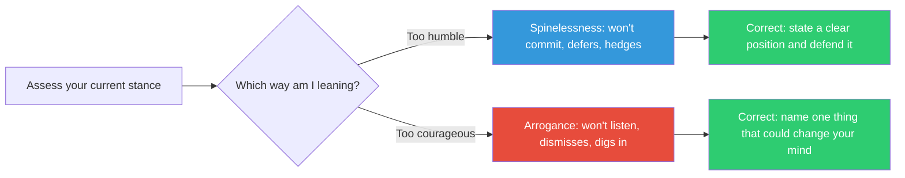

## The Move

Intellectual virtues exist in tension pairs. Humility without courage is spinelessness — you never commit to a position, you hedge endlessly, you defer to everyone. Courage without humility is arrogance — you never update, you dismiss criticism, you mistake conviction for correctness. Ask yourself two questions: "Am I being appropriately humble, or am I using humility to avoid taking a stand?" and "Am I being appropriately courageous, or am I being dogmatic?" Name which way you are currently leaning. Then deliberately correct one notch toward the other.

## When to Use

- You have been "gathering input" for too long and still will not decide
- Someone has told you (or you sense) that you are being stubborn
- A decision is stuck because nobody will take a position
- You feel paralyzed between confidence and uncertainty

## Diagram

## Example

**Situation:** A tech lead has been evaluating whether to use a relational database or a document store for a new service. They have collected opinions from six team members, read four comparison articles, and set up two prototypes. Three weeks have passed. When asked for a recommendation, they say "it depends on the access patterns, which we're still defining."

**Diagnosis:** Leaning too far toward humility. The tech lead is using legitimate uncertainty as a shield against making a call that might be wrong. The access patterns will never be fully defined before launch.

**Correction:** State a position: "I recommend PostgreSQL with JSONB columns. Here is my reasoning, here are the two conditions under which I'd switch to Mongo, and here is when we should revisit." The position might be wrong. That is what courage means — committing under uncertainty because indefinite hedging has its own cost.

**Counter-example:** A different tech lead announces on day one, "We're using Mongo, I've used it before, it's fine." When the team raises concerns about transaction support, the lead says "we'll work around it." When a senior engineer presents benchmarks showing PostgreSQL outperforms for this workload, the lead says "benchmarks don't tell the whole story."

**Diagnosis:** Leaning too far toward courage. The correction is: "Name one specific finding that would make you switch to PostgreSQL. If you can't name one, you're not being courageous — you're being closed."

## Watch Out For

- The balance point is not static. Early in exploration, lean toward humility (gather more). Late in a decision, lean toward courage (commit and learn). Know which phase you are in
- Teams often have a cultural lean. Some teams never commit (collective humility dysfunction). Some teams never question the loudest voice (collective courage dysfunction). Notice the team pattern, not just your own
- This is a snap-effort move. If you spend more than two minutes on it, you are hedging again
