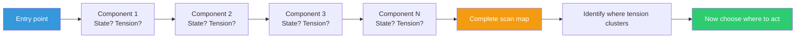

## The Move

Start at the entry point of your system — the user's first interaction, the API gateway, the main() function. Move your attention through each component in the order a request or action flows through the system. At each stop, answer three questions: (1) What is the current state here? (2) Is there tension — anything that feels fragile, slow, unclear, or over-complicated? (3) What am I assuming about this component that I haven't verified?

Do not fix anything. Do not open a ticket. Do not start refactoring. Complete the entire scan first. Write one line per component: name, state, tension (if any). The completed scan is a map of where attention is needed — and that map is more valuable than any single fix.

## When to Use

- Starting a new project or inheriting an unfamiliar codebase
- Before sprint planning or prioritization — see the full landscape first
- When bugs keep appearing in "surprising" places
- After a major change, to check for ripple effects
- When you feel like you're playing whack-a-mole with issues

## Diagram

## Example

**Situation:** A team lead inherits a Node.js e-commerce platform after the previous lead left. Users report "it feels slow" but nobody knows where.

**The scan:**

| Component | State | Tension |
|-----------|-------|---------|
| Nginx reverse proxy | Running, default config | None apparent |
| Express API gateway | 47 routes, no rate limiting | Mild — no protection |
| Auth middleware | JWT validation on every request | Tension — verifying against DB on each call |
| Product service | 3 endpoints, well-tested | Clean |
| Cart service | 12 endpoints, 0 tests | High tension — untested, most complex |
| PostgreSQL | 230ms avg query time | Tension — no query optimization, missing indexes |
| Redis cache | Exists but hit rate is 12% | High tension — cache exists but barely works |
| Payment integration | Stripe, working | Clean |
| Email service | SES, 2% bounce rate | Mild tension |

**What the scan reveals:** The "slowness" isn't in one place. It's the combination of per-request DB auth checks, unoptimized Postgres queries, and a cache that isn't caching. No single component is "broken" — the tension is distributed. Without the full scan, the team would have optimized whichever component they looked at first.

## Watch Out For

- The hardest part is NOT FIXING things as you scan. Your instinct will be to stop and address the first issue. Resist. The full map changes what you'd prioritize
- Don't confuse "unfamiliar" with "tense." A component you don't understand isn't necessarily unhealthy — it might just need learning
- Keep the scan at a consistent level of depth. Don't spend 20 minutes on one component and 10 seconds on another
- This move produces a map, not a plan. You still need to prioritize after scanning. The scan just ensures you're prioritizing from full awareness, not partial
