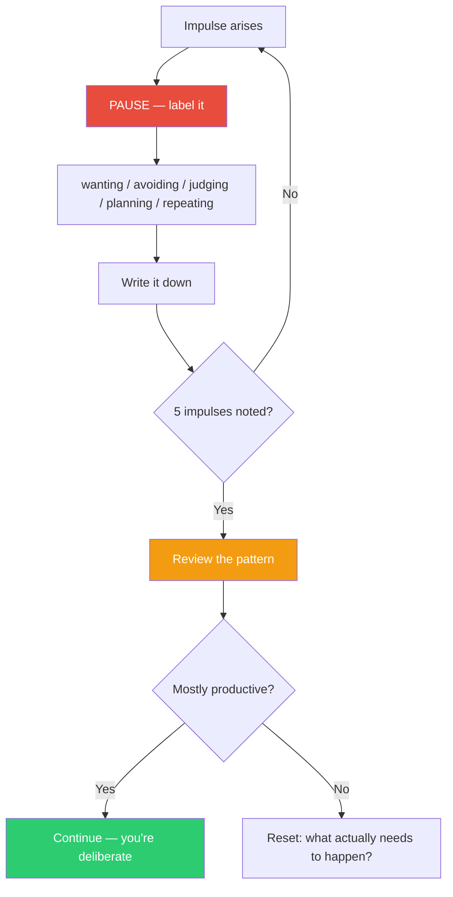

## The Move

Pause. For the next 5 impulses you have about this problem, label each one before acting on it. Use simple categories: **wanting** ("I want to rewrite this"), **avoiding** ("I don't want to look at that module"), **judging** ("this code is terrible"), **planning** ("I should set up a meeting"), **repeating** ("let me re-read this again"). Write each label down. Then look at the list: how many are productive moves versus autopilot reactions? Act only on the ones you consciously choose after seeing the pattern.

The label creates a gap between impulse and action. Most bad technical decisions happen in the absence of that gap.

## When to Use

- You notice you've been "busy" for 30 minutes without clear progress
- After receiving feedback that triggered a strong reaction
- When you catch yourself starting something without deciding to start it
- At the beginning of a work session, to set a deliberate tone
- When you suspect you're avoiding the hard part of the problem

## Diagram

## Example

**Situation:** A developer receives a code review with 8 comments. She starts reading them.

**Noting the impulses:**

1. "I should fix the formatting issues first" — **avoiding** (starting with the easy stuff to delay engaging with the hard feedback)
2. "This reviewer doesn't understand the context" — **judging** (defensive reaction to criticism)
3. "Let me re-read my original PR description" — **repeating** (re-reading to feel justified, not to learn)
4. "I need to refactor the whole auth module" — **wanting** (over-scoping in response to a pointed critique)
5. "I should address the race condition comment" — **planning** (first genuinely productive impulse)

**The pattern:** 4 out of 5 impulses were defensive reactions, not productive moves. Without noting, she would have spent 30 minutes on formatting and rereading before touching the substantive feedback. The noting practice redirected her to impulse #5 — the one that actually mattered.

## Watch Out For

- Don't judge the labels. "Avoiding" isn't bad — sometimes the thing you're avoiding genuinely isn't important. The point is to NOTICE, not to force yourself into discomfort
- Five impulses is enough. Don't turn this into a permanent monitoring state — that creates its own paralysis
- The categories are suggestions, not a taxonomy. If "panicking" or "people-pleasing" better describes your impulse, use that
- This move is hardest when you need it most. Strong emotional reactions make labeling feel impossible. That's exactly when the gap matters most
