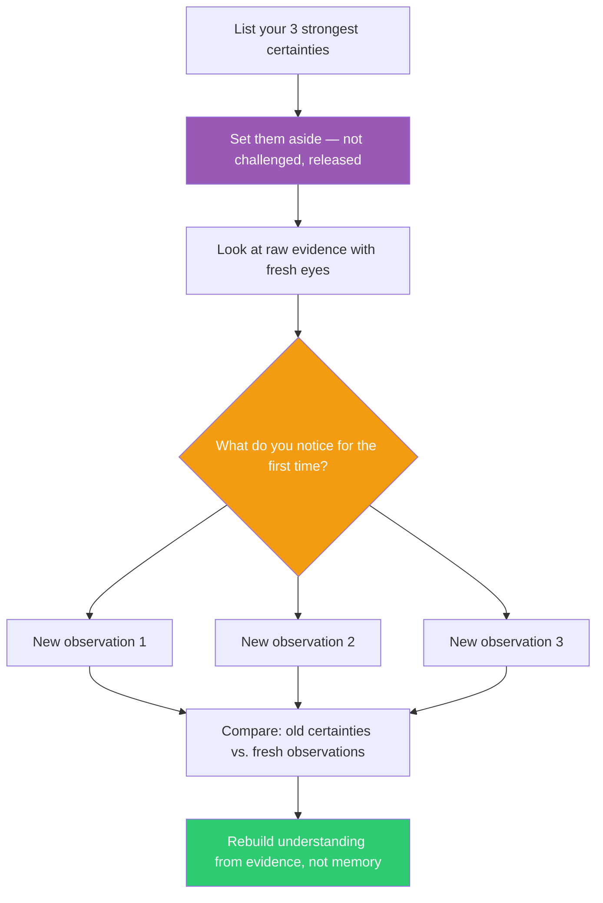

## The Move

Write down the three things you are MOST CERTAIN about regarding this problem. Your strongest assumptions, your deepest prior knowledge, the patterns you've been applying without questioning. Now: deliberately set them aside. Not "challenge" them — suppress them. Approach the problem as if encountering it for the first time with zero context. Look at the raw evidence — the code, the data, the user behavior — without letting prior patterns pre-filter what you see. What do you notice that your existing model was rendering invisible?

This is not role-playing ignorance. This is recognizing that your mental model, however good, is a filter — and filters block as well as clarify.

## When to Use

- You're the most experienced person on the problem and you're the most stuck
- You keep defaulting to "the way we've always done it"
- A junior team member suggested something you dismissed, and it's nagging at you
- The problem domain has changed but your mental model hasn't updated
- Your confidence is high but your progress is low

## Diagram

## Example

**Situation:** A senior backend engineer is designing a caching layer for a high-traffic API. She's built caching systems five times before and immediately reaches for Redis with TTL-based invalidation — her proven pattern.

**Three strongest certainties:**
1. "Redis is the right tool for this scale"
2. "TTL-based invalidation is the simplest correct approach"
3. "The bottleneck is database reads"

**Emptying the cup:** She sets these aside and looks at the actual traffic data as if for the first time. Fresh eyes notice: 80% of requests are for the same 50 resources. The "high traffic" is actually high traffic to a tiny dataset. The remaining 20% are long-tail queries that are rarely repeated.

**What expertise hid:** A Redis cluster with TTL invalidation is the right answer for distributed, varied caching. For 50 hot resources, an in-memory LRU cache in the application process — no network hop, no serialization, no infrastructure — handles 80% of load. Her expertise jumped to the sophisticated solution and skipped the obvious one.

## Watch Out For

- Emptying the cup is temporary. You're not abandoning expertise permanently — you're clearing the lens for 10 minutes to see what it was filtering out
- This is genuinely difficult for skilled practitioners. If it feels easy, you may be performing beginner's mind rather than experiencing it
- Don't confuse this with imposter syndrome or self-doubt. You ARE an expert. The point is that expertise has blind spots, and this move illuminates them
- After the exercise, integrate fresh observations WITH your expertise. The best solutions come from beginner's eyes combined with expert hands
