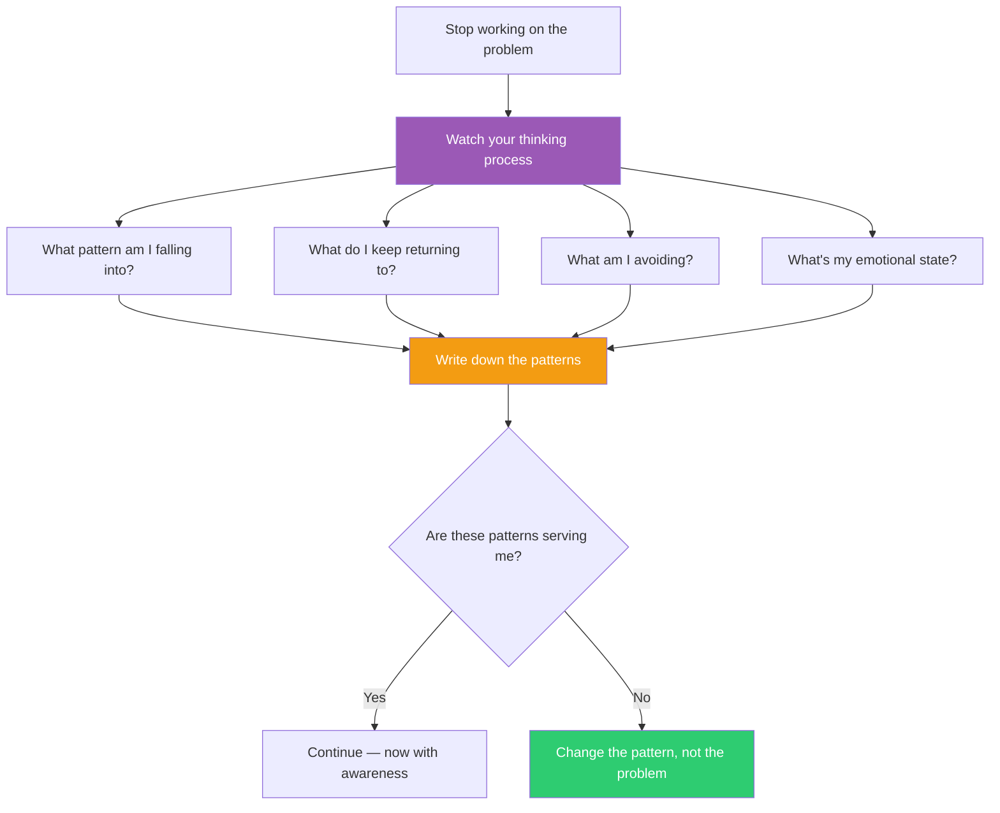

## The Move

Stop working on the problem. If {{thinker.1}} observed your thinking process, what pattern would they name? Examine your own processing patterns by answering these four questions in writing: (1) What pattern does my approach keep falling into? What am I repeating? (2) What do I keep returning to — and why? (3) What am I systematically avoiding or not looking at? (4) What is driving my choices right now — and is it the problem's structure or my own defaults?

The patterns you discover are invisible from inside the work. Stepping back to examine them reveals what working-on-the-problem never will — because the patterns ARE the approach.

## When to Use

- You've been working for over an hour and feel like you're going in circles
- You suspect emotional state (frustration, excitement, fear) is driving technical decisions
- After a heated discussion, before making a final decision
- When you notice yourself repeatedly drawn to the same approach despite evidence against it
- At the end of a workday, to extract lessons before context is lost

## Diagram

## Example

**Situation:** An engineer has spent three hours designing a data pipeline. She's evaluated four architectures, written pros/cons for each, and still can't decide.

**Observing the observer:**

1. **Pattern:** "I keep adding evaluation criteria. Every time I'm about to decide, I think of one more thing to compare. The pattern is avoidance through analysis."
2. **Returning to:** "I keep going back to the Kafka-based design. I've 'rejected' it twice but it keeps pulling me back. Maybe my gut already decided and my analysis is fighting it."
3. **Avoiding:** "I haven't looked at the simplest option — a cron job with a database query. I dismissed it in the first 5 minutes as 'not scalable enough.' I haven't revisited that assumption with actual numbers."
4. **Emotional state:** "I'm anxious about choosing wrong because the last pipeline I designed had to be rewritten. That fear is driving the over-analysis."

**What shifts:** She sees that the problem isn't "which architecture" — the problem is fear of repeating a past mistake, which is generating endless evaluation criteria to delay commitment. She can now separate the technical decision from the emotional one. The cron job handles current scale. She'll revisit when actual numbers demand it.

## Watch Out For

- This move can become navel-gazing. Limit it to 60-90 seconds. You're gathering a quick snapshot, not writing a therapy journal
- Honesty is the only requirement. If you observe "I'm choosing this architecture because it looks impressive on my resume," that's useful data, not a character flaw
- Don't observe the observer observing the observer. One level of meta is enough. The point is to see the pattern, not to build an infinite regress
- The patterns you discover may be uncomfortable. That's the point. Comfortable self-assessment rarely reveals anything new
