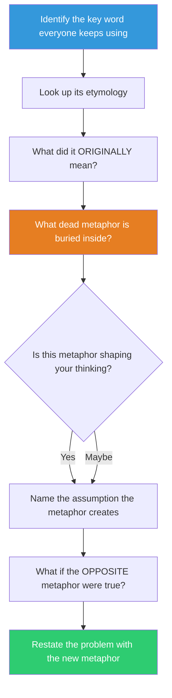

## The Move

Identify the key word in your problem — the one that appears in every description, the one everyone uses without questioning. Look up (or reason about) its etymology: what did it originally mean, literally? "Decide" comes from Latin *decidere* — to cut off. "Problem" from Greek *proballein* — to throw forward. "Computer" once meant a human who computes. "Manager" from Italian *maneggiare* — to handle horses. Write down the original meaning. Now ask: is the dead metaphor inside this word shaping how I think about the problem? If "deciding" is "cutting off," am I unconsciously treating every decision as an elimination rather than a selection? Also trace the key word in {{language.1}} — what root does it come from there? Name the hidden metaphor. Then ask: what if the opposite metaphor were true?

## When to Use

- A key term has become so familiar that nobody examines what it actually means
- Different people use the same word but seem to mean different things
- You want a fast way to surface a hidden assumption (under 2 minutes)
- The problem's framing feels inherited — someone else named it and the name stuck

## Diagram

## Example

**Problem:** "We need to refactor the authentication service."

**Key word:** "Refactor."

**Etymology:** "Factor" comes from Latin *factor* — one who makes or does, from *facere* (to make). "Re-factor" literally means "re-make" — break something into its factors (components) and reassemble. The mathematical sense: find the prime factors.

**Hidden metaphor:** Refactoring treats code as a product of factors — implying the code has a unique correct decomposition, the way 12 = 2 x 2 x 3. But code doesn't have prime factors. There are many valid decompositions, and the right one depends on what you want to change next.

**What shifted:** The team was debating the "right" refactoring as if there were one correct answer. The etymology revealed the assumption: that the code has a unique factorization. Once named, the team asked "what do we need to change most often?" and refactored for THAT axis of change, rather than searching for the theoretically "correct" decomposition.

## Watch Out For

- This is a 2-minute move, not a research project. A rough etymology is enough — you need the metaphor, not the philology
- Not every etymology is illuminating. If the word's history doesn't reveal a hidden assumption, move on. Don't force insight
- The most productive words to dig into are the ones that feel the most "obvious" — the terms so natural that questioning them feels silly
- Teams sometimes resist this move because it feels pedantic. Frame it as: "what picture does this word paint in our heads, and is that picture helping or hurting?"
