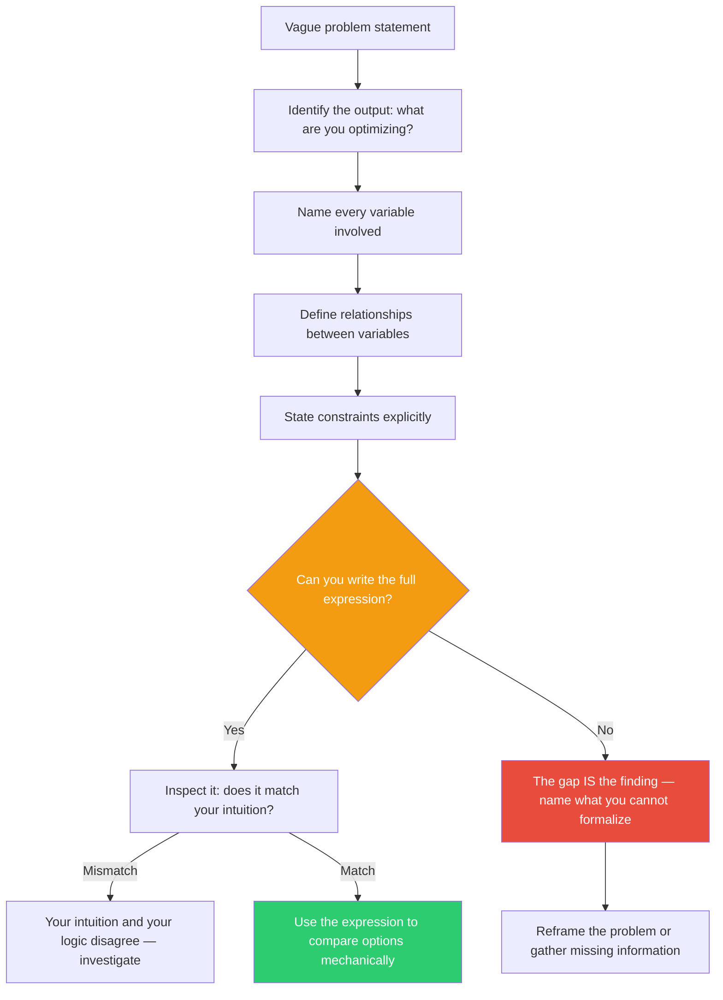

## The Move

Write your problem as a formal expression. Pick the notation that fits: a math equation, a logical predicate, a type signature, or pseudocode with named variables. Name every variable. Define every relationship. State what you are maximizing or minimizing. State every constraint explicitly: `subject to X > 0, Y + Z <= budget, latency < 200ms`. If you cannot write the expression, identify the exact point where you get stuck — that gap is the most important thing you have found. Natural language hides ambiguity behind comfortable vagueness. Formalization strips it bare.

## When to Use

- When a team debate keeps circling without resolution — force everyone to agree on the same equation
- When you can describe a goal in English but cannot measure whether you have achieved it
- When you need to compare two options and the comparison feels subjective
- When requirements seem clear until you sit down to implement them
- When you suspect you are optimizing for the wrong thing

## Diagram



## Example

**Problem:** "We need to improve the search experience."

That sentence contains zero information about what "improve" means. Formalize it:

```
maximize: relevance(results, user_intent)
subject to:
  latency(query) < 200ms
  cost_per_query < $0.003
  results.length >= 5
  results.length <= 20
  diversity(results) > threshold_d
```

Immediately you discover three things you had not decided:

1. **What is `relevance`?** Click-through rate? Time-to-find? User rating? You cannot optimize what you have not defined.
2. **Is there a diversity constraint?** The business wants varied results, but nobody stated it — so the ranker is free to return 20 near-duplicates.
3. **Cost and latency compete with relevance.** A more expensive model improves relevance but violates the cost constraint. Now you have a real tradeoff to evaluate instead of a vague aspiration.

The formalization turned a wish ("improve search") into a concrete optimization problem with testable constraints.

## Watch Out For

- Formalization is a thinking tool, not a delivery artifact. Do not let the notation become the goal. The point is to find what you cannot formalize, not to produce a pretty equation.
- Some problems resist formalization because they are genuinely multi-objective with no clear weighting. That is a finding, not a failure. Name the objectives and decide the weights explicitly.
- Beware false precision. Writing `relevance > 0.85` feels rigorous but is meaningless if you have not defined how relevance is measured. The formalism is only as good as the definitions behind the symbols.
- If the formalization feels trivial, you are probably formalizing the wrong level. Go one level deeper — formalize the *mechanism*, not just the goal.
