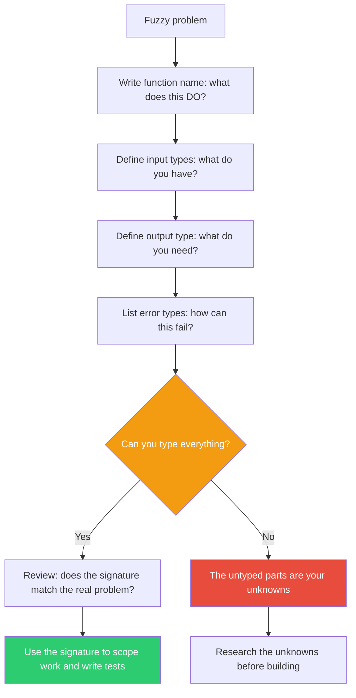

## The Move

Write your problem as a function signature. Define the inputs with their types. Define the output with its type. Do NOT write the body — just the interface. `function solve(context: ???, constraints: ???): ???`. Now ask three questions in order. First: what are the types of each input? If you cannot name them, you do not know what you are working with. Second: what is the return type? If it is vague ("something better", "an improvement"), you do not have a goal. Third: what errors can this function throw? List every way this function can fail. Those are your risk cases — and they are often more informative than the happy path. The type system is a thinking tool that forces precision about the shape of your problem without requiring you to solve it.

## When to Use

- When the problem feels understood but implementation keeps surprising you
- When a team cannot agree on the scope of a feature — write the function signature together
- When you want to separate "what shape is the problem" from "how do I solve it"
- When you keep discovering edge cases mid-build — the error types were not enumerated up front
- When a planning discussion is too abstract and needs to be grounded

## Diagram



## Example

**Problem:** "We need to build a feature that recommends related content to users."

Before writing any code, write the signature:

```typescript
type Recommendation = {
  contentId: string;
  score: number;       // 0-1, relevance to the seed content
  reason: string;      // explainable: "same author", "similar tags", etc.
};

type RecommendError =
  | { kind: "content_not_found"; contentId: string }
  | { kind: "insufficient_history"; userId: string; minimum: number }
  | { kind: "cold_start"; userId: string }  // new user, no signal
  | { kind: "timeout"; elapsedMs: number }
  | { kind: "model_unavailable" };

function getRecommendations(
  userId: string,
  seedContentId: string,
  context: {
    maxResults: number;
    excludeAlreadySeen: boolean;
    freshnessBias: number;  // 0 = ignore recency, 1 = heavily prefer recent
  }
): Result<Recommendation[], RecommendError>;
```

Without writing a single line of implementation, you have discovered:

1. **You need a `reason` field.** The PM said "recommendations" but did not say whether they need to be explainable. The type forces the question. Turns out the design requires showing "why" each item was recommended.
2. **Cold start is a real error case.** New users have no history. The function cannot return useful results. This is not a bug — it is a named condition that needs a fallback UX.
3. **`freshnessBias` is a parameter, not a constant.** Different pages might want different freshness weights. Making it explicit in the signature prevents it from being hardcoded and forgotten.
4. **`model_unavailable` means you need a degraded mode.** If the ML model is down, does the feature disappear or fall back to tag-based matching? The error type forces the decision now, not during an incident.

The signature became the spec. The team aligned on scope by reviewing types, not paragraphs.

## Watch Out For

- Do not implement the body. The moment you start solving, you lose the benefit of the exercise. The signature IS the thinking tool.
- If every input is typed as `string` or `any`, you are not being specific enough. Push until the types carry meaning: `UserId`, not `string`; `Score` with a range, not `number`.
- The error types are not optional. Skipping them defeats half the value. Every `throw` is a scenario your system must handle — enumerate them now or discover them in production.
- This move is for thinking, not for shipping. The signature you write here might not match your final API. That is fine. The goal is to learn what you do not know, not to produce production code.
- If the problem is not computational in nature, this grammar may not fit. Use TF-202 (Formalize It) for mathematical or logical problems instead.
