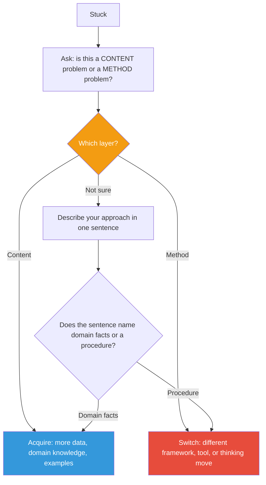

## The Move

Ask one question: "Am I stuck on the CONTENT of this problem (the domain, the data, the thing itself) or on the METHOD I'm using to think about it?" Write a single sentence naming which layer you are on. If it is content, your next step is to acquire more knowledge, data, or domain expertise. If it is method, your next step is to switch your thinking tool, framework, or approach entirely. Do not push harder on content when the real blocker is method — a stronger push on the wrong method will never unstick you.

## When to Use

- You have been stuck for more than 15 minutes and effort is not converting into progress
- You notice yourself re-reading the same material or re-running the same analysis hoping for a different result
- A teammate has given you more domain context but it did not help
- You suspect you are solving the wrong problem but cannot articulate why

## Diagram

## Example

**Situation:** You are debugging a memory leak in a Node.js service. You have been reading heap snapshots for 40 minutes. You understand the V8 garbage collector well. You can see retained objects growing. But you cannot figure out which code path is holding the reference.

**Apply the move:** "Am I stuck on content or method?"

- **Content would mean:** you lack knowledge about how V8 manages memory, or you do not understand the application domain. But you do — you can read the snapshots fine.
- **Method is the real issue:** your method is "stare at heap snapshots and trace backwards." That method has stalled. Switch method: instead of analyzing the heap, write a reproduction script that isolates subsystems one at a time. Or use `--expose-gc` with forced collections between requests to narrow the lifecycle. The domain knowledge was never the blocker — the investigation technique was.

## Watch Out For

- "Both" is a cop-out answer most of the time. Force yourself to pick one as the primary blocker right now. You can revisit the other layer later
- Method problems often disguise themselves as content problems. The symptom is "I need to understand this better" when the real issue is "I need to approach this differently"
- This is a diagnostic move, not a solution. Once you identify the layer, you still need a follow-up move — TF-005 or TF-152 for method issues, domain research for content issues
