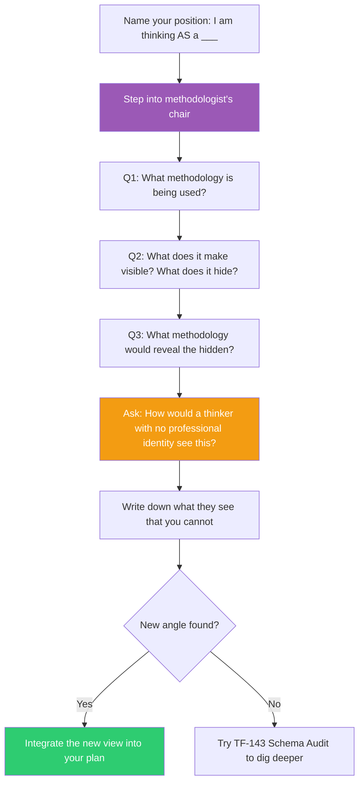

## The Move

Name your professional position: "I am thinking about this AS a ___." Now step outside it entirely. Ask three questions from the methodologist's chair: (1) What methodology is being used here? (2) What does that methodology make visible, and what does it hide? (3) What methodology would make the hidden things visible? Then ask: how would {{thinker.1}} approach this if they had no professional identity at all — if they were simply a thinker encountering this situation for the first time? Write down what they might see that your professional position cannot.

## When to Use

- You notice your proposed solution suspiciously matches your job description (the engineer proposes a technical fix, the designer proposes a redesign, the PM proposes a process change)
- A cross-functional team is stuck because each member keeps pulling toward their own domain
- You are evaluating a plan and want to check for professional blind spots
- The problem has resisted domain-expert solutions and may need a non-domain perspective

## Diagram

## Example

**Situation:** Your team is debating how to handle a sudden spike in customer churn. The backend engineer says the API is too slow and wants to optimize response times. The designer says the onboarding flow is confusing and wants to redesign it. The PM says the pricing tier is wrong and wants to restructure plans. Everyone has data supporting their view. The debate has gone three rounds with no resolution.

**Exit your position:**

1. *"I am thinking about this AS an engineer."* Name it. Set it down.
2. *Methodologist's chair:* The methodology being used is "each specialist diagnoses within their domain and proposes a domain-native fix." This makes visible the things each domain can measure (latency, usability scores, conversion rates). It hides anything that crosses domain boundaries — for example, whether churn correlates with a specific user journey that touches all three domains in sequence.
3. *What methodology would reveal that?* Cohort analysis on the full user journey, not segmented by domain. Map the actual paths of churned users across all touchpoints.
4. *A thinker with no professional identity* might simply ask: "Have you talked to the people who left? What did they say?" No methodology at all — just direct contact with the phenomenon.

**Result:** The team stops debating domain fixes and instead interviews 10 churned users. They discover the real issue: users who hit a specific error during their first integration attempt never come back. It is a cross-domain problem (API error + unclear error message + no recovery flow in onboarding) that no single professional position could see.

## Watch Out For

- Exiting your position does not mean your expertise is wrong — it means it is partial. You will return to your position after seeing the fuller picture
- The methodologist's chair can become its own professional position. Do not get stuck there. The point is to see and then act, not to endlessly analyze methodologies
- In team settings, asking others to exit their positions can feel threatening. Frame it as "let's all step out together" rather than "your view is biased"
- This move takes practice. The first few times you will find yourself sneaking back into your professional frame mid-exercise. That is normal — just notice it and step out again
